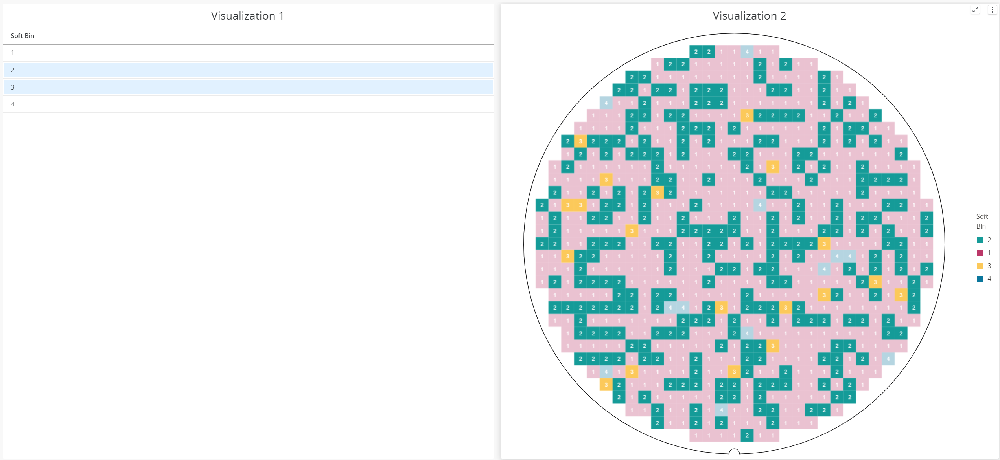

# Nimble Wafer Map Die Highlighting

## Problem Statement

The wafer map receives an array of strings as the values that will be highlighted.

```
@observable public highlightedValues: string[] = [];
```

In the following case the highlighted values are 2 and 3.



The current approach is limited. We can either highlight all the dies having 2s and 3s or neither of them. The customer needs exceeds this approach. The customer may see an anomaly on the dies having DieX: 15 and Soft Bin: 2 and wishes to highlight all these values, but the current code is not capable of this.

## Links To Relevant Work Items and Reference Material

N\A

## Implementation / Design

We will replace the old logic, removing it completely, and add a new one.

Each die will have an optional field called "tags", being optional in the cases when we don't use highlighting we can get rid of it.

```
export interface WaferMapDie{
...
   tags?: string[];
...
}
```

Example of tags:

```
{ 'sb1', 'hb2' }
```

We will make the highlights based on this tags. The wafer will receive a list of highlightedTags

```
@observable public highlightedTags: string[][]
```

Example:

```
[
    [{ 'sb2', 'hb3' }],
    [{ 'sb1' }]
]
```

in this case we would expect that all dies having sb 2 and hb 3 or having only sb 1 to be highlighted
