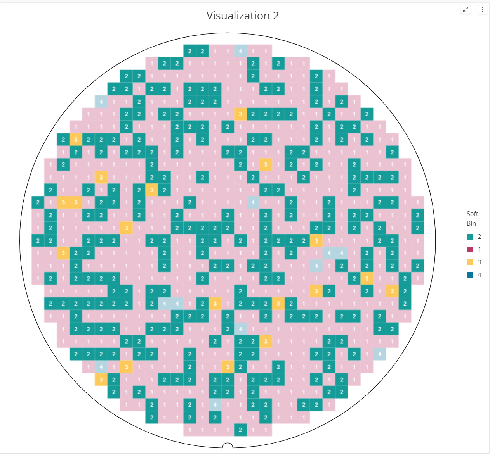
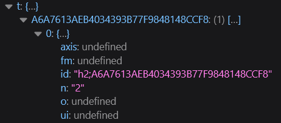
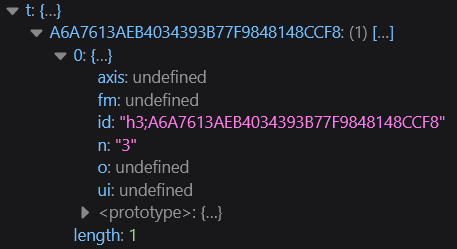
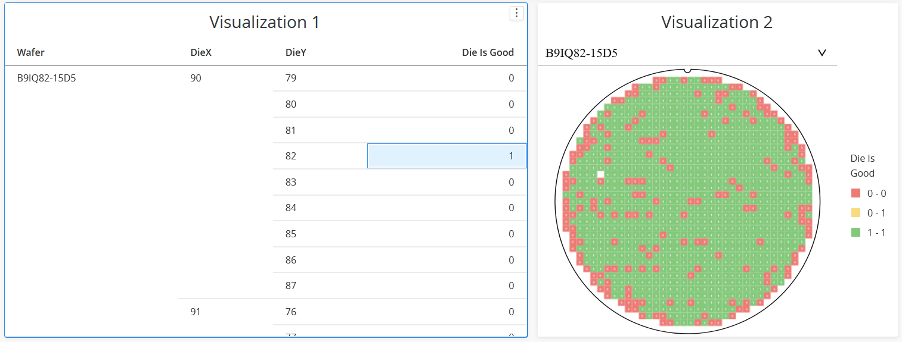
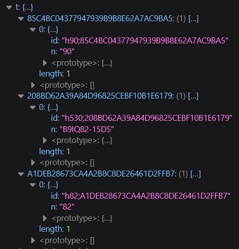
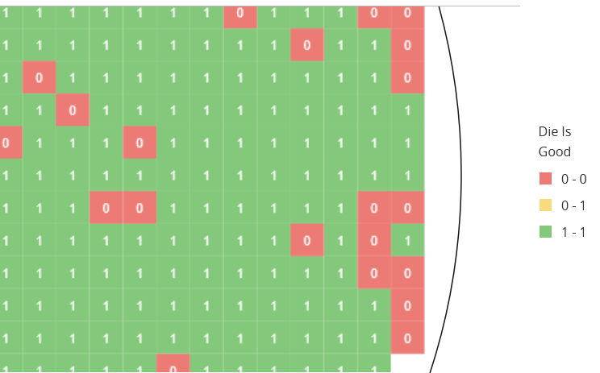
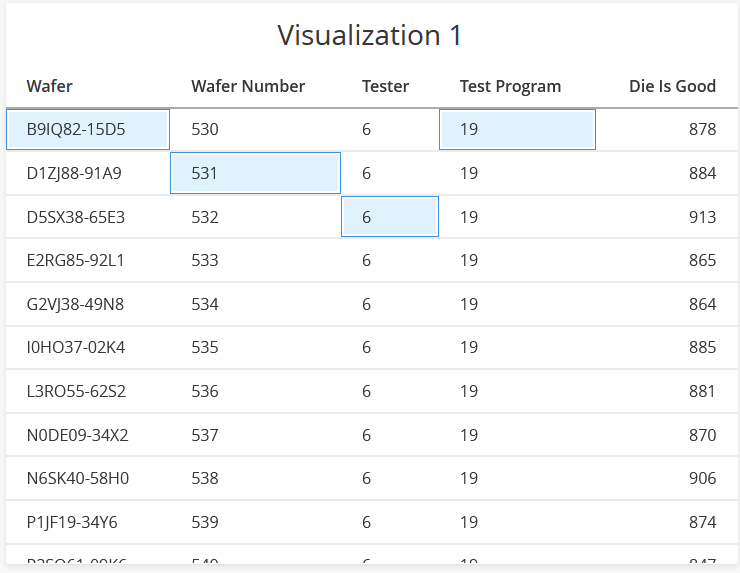

# Nimble Wafer Map Die Highlighting

## Problem Statement

The wafer map receives an array of strings as the values that will be highlighted.

```ts
@observable public highlightedValues: string[] = [];
```

In the following case the highlighted values are 2 and 3



Inside a data visualization tool we wish to highlight dies in a wafer map based on selections in a different visualization.

Example:


The function that watches the changes made on selections retrieves the values one by one, like this.

n - the selected value

id - the id of the selected attribute, in the case from above is the id of Soft Bin




Soft Bin is an attribute, data that has a meaning of its own.

In the following case, "Die is Good" is a column computed based on the other attributes/columns, data that has meaning only paired with other attributes, we call it a "metric".



Metrics data is retrieved differently than attribute data. Instead of receiving the metric id and the value, we receive all the values and attributes based on which the metric was computed:



You can see the IDs and the corresponding values of Wafer (B9IQ8...), DieX (90) and DieY (82)

The component can highlight only based on the value that appears on the die. For example here:



We wish to not be constrained by the values appearing on the die but to be able to highlight based on what we receive from the selection function

## Links To Relevant Work Items and Reference Material

[MicroStrategy Enable Custom Selection and Highlighting](https://www2.microstrategy.com/producthelp/Current/VisSDK/Content/topics/HTML5/selection_highlightAPI.htm)

[Introduction to Attributes, Metrics, and Groups](https://www2.microstrategy.com/producthelp/Current/MSTRWeb/WebHelp/Lang_1033/Content/CreatingNewObjects.htm)

## Implementation / Design

We will replace the old logic, removing it completely, and add a new one.

Each die will have an optional field called "tags", being optional in the cases when we don't use highlighting we can get rid of it.

```ts
export interface WaferMapDie{
...
   tags?: string[];
...
}
```

How the tags looks like remain a choice of the user, they can either have a simplified form

```ts
['a', 'b', 'c'];
```

Or can be the id of the attributes

```ts
[
    'h90;85C4BC04377947939B9B8E62A7AC9BA5',
    'h530;208BD62A39A84D96825CEBF10B1E6179',
    'h80;A1DEB28673CA4A2B8C8DE26461D2FFB7'
];
```

We will make the highlights based on this tags. The wafer will receive a list of highlightedTags

```ts
@observable public highlightedTags: string[]
```

Example of flow :

```ts
export const dies: WaferMapDie[] = [
    {
        x: 0,
        y: 0,
        value: '14',
        tags: ['a']
    },
    {
        x: 1,
        y: 0,
        value: '76',
        tags: ['a', 'b']
    },
    {
        x: 0,
        y: 1,
        value: '72'
    }
];
```

A die will be highlighted if any of the die's tags equals at least one value in the highlightedTags

If the highlightedTags equals

```ts
['a'];
```

dies[0][0] will be highlighted because it contains 'a'

dies[1][0] will be highlighted because it also contains 'a'

dies[0][1] will not be be highlighted because it does not have any tag

```ts
['b', 'h'];
```

dies[0][0] will not be highlighted because it does not contain 'b' neither 'h'

dies[1][0] will be highlighted because it contains 'b'

dies[0][1] will not be be highlighted because it does not have any tag

If the highlightedTags equals

```ts
[];
```

Nothing will be highlighted

If the highlightedTags equals

```ts
['efg'];
```

All dies will be faded

Note: Besides the code changes we will also need to update the tests and nimble story book.

## Alternative Designs

1. Same as the main one but instead of using a strings array for highlighted tags use an matrix of strings. This will give us more flexibility and more highlight capabilities but it will also require more time and will increase the complexity of complexity of the highlighting. In this case:



the highlightedTags would look like

```ts
[['B9IQ82-15D5', '19'], ['531'], ['6']];
```

despite the fact that this would give us great capabilities of highlighting the api that we use to get this values is limited, and it can't make the difference between 'B9IQ82-15D5' AND '19' compared to 'B9IQ82-15D5' OR '19'. As I said, in case of attributes, the api retrieves them one by one, not knowing the relation between them. Also if we would want to go in this direction we would need to develop a Set Theory for highlighting, which for now may be an overkill.

2. Introduce a new logic of highlighting the wafer in parallel with current one

Each die will have an optional field 'isHighlighted' that will not be populated if no highlight is made

```ts
export interface WaferMapDie{
...
   🟢isHighlighted?: boolean;🟢
...
}
```

```ts
        ...
        for (const die of this.wafermap.dies) {
            ...
            this._diesRenderInfo.push({
                ...
                fillStyle: this.calculateFillStyle(
                    die.value,
                    colorScaleMode,
                    highlightedValues,
                    🟢 die.isHighlighted🟢
                ),
                ...
            });
        }
        ...
```

```
    ...
    private calculateFillStyle(
        ...
        🟢isHighlighted?: boolean🟢
    ): string {
        ...
        rgbColor = new ColorRGBA64(
            ...
            this.calculateOpacity(value, highlightedValues, 🟢isHighlighted🟢)
        );
        ...
    }
    ...
```

```
...
    private calculateOpacity(
        ...
        🟢isHighlighted?: boolean🟢
    ): number {
        return 🟢isHighlighted🟢 || (highlightedValues.length > 0
            && !highlightedValues.some(dieValue => dieValue === selectedValue))
            ? this.nonHighlightedOpacity
            : 1;
    }
...
```

This approach will let us to highlight any die we want, without any restrictions. The logic that decides which dies should be highlighted can be moved completely out of the wafer map component, leaving the component the duty of only highlighting the given dies using the "isHighlighted" field.
