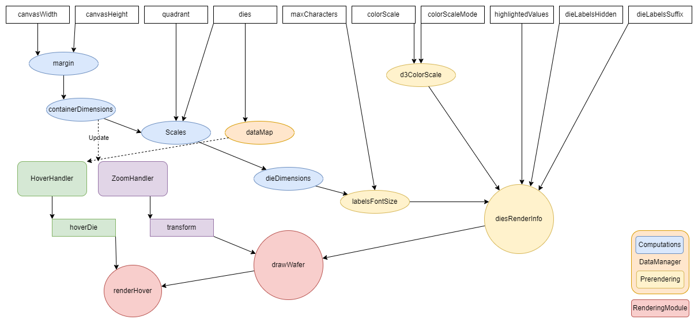

# Nimble Wafer Map ataManager Refactor

## Problem Statement

In the current implementation, the WaferMap component initializes the `DataManager`, and the rest of the modules each time an input is changed.
This is not optimal and causes unwanted computation time especially when zooming on the wafer.

We need an optimal way to refresh the rendering and the metadata based on the changed inputs.
In the following image the inputs and the chain of change dispersion inside the wafer are displayed.



Based on this visualization a new method for recalculating only the needed data can be devised.

## Links To Relevant Work Items and Reference Material

[Wafer Map Spec](../README.md)

## Implementation / Design

The designed architecture consists of a pipeline of sequential steps, where each step can be triggered as a starting point or skipped entirely, and an update tracker which maintains a queue of steps to be run in the pipeline, which can be added to as needed.

When an update is triggered, the update tracker batches together all queued steps in the correct order and runs the pipeline exactly once. This architecture allows for efficient updates of the pipeline without needing to run the entire pipeline every time.

For the wafer map we are going to create a pipeline which contains the split update steps in the required order and each input change will enqueue a starting step. When the batch update starts the highest priority step will be the start of the pipeline.

### Pipeline

The pipeline is a series of steps that are executed sequentially. Each step has a name and an asynchronous function that performs a specific action. The pipeline can be triggered from any step.

#### Class: Pipeline

##### Pipeline Properties

- `steps`: An array of Step objects representing the steps of the pipeline.

##### Pipeline Methods

- `constructor(steps: Step[])`:
  - Initializes a new Pipeline object with the specified steps.

- `run(startingStep?: string)`:
  - Executes the pipeline starting from the specified step (default is the first step).

### Update Tracker

The update tracker keeps track of which steps of the pipeline need to be updated. It allows you to enqueue multiple steps to be updated and then execute the pipeline with the queued steps in the correct order.

#### Class: UpdateTracker

##### UpdateTracker Properties

- `stepsQueue`: A set of Step names representing the steps that need to be updated.

##### UpdateTracker Methods

- `constructor(pipeline: Pipeline)`:
  - Initializes a new UpdateTracker object with the specified Pipeline.

- `trackStep(step: string)`:
  - Adds the specified step name to the steps queue, if it hasn't already been enqueued.

- `trackSteps(steps: string[])`:
  - Adds an array of step names to the steps queue, if they haven't already been enqueued.

- `runOnlyQueuedSteps()`:
  - Executes the pipeline with just the steps in the update queue in the correct order.

- `runPartialPipeline()`:
  - Executes the pipeline starting with the highest priority step in the steps queue.

#### Class: Step

##### Step Properties

- `name`: A string representing the name of the step.
- `action`: An asynchronous function representing the action that the step performs.

##### Step Methods

- `constructor(name: string, action: () => Promise<void>)`:
  - Initializes a new Step object with the specified name and action.

## Alternative Implementations / Designs

### Public Update Methods

The `DataManager` will expose public methods for updating the internal state.
These methods will form a hierarchy and will call other methods themselves.

For example:

```TS
// top level function; will call update scales
public updateMargin(): void {
    ...
    this.updateScales();
}

// lower level function; will call update labels
public updateScales(): void;
...
```

When input change, the callbacks can call the methods themselves and the `DataManager` will get updated and not re-initialized.

The downsides to this method are keeping an up to date hierarchy and the level at which every input exerts it's change and given multiple input changes in a small time frame the computation effort will be increased compared to the current method.

### Tagged Pooling

For fixing the multiple input changes in a short period of time we can create a tagging system for queueing updates. The tags will represent the impact of the input in the propagation of change. Each queueing request will update the scope of the update based on the highest tag in the pool of input changes.

```TS
private queueDataUpdate(tag: number): void {
    if (!this.updateQueued) {
        this.updateQueued = true;
        this.updateTag = tag;
        DOM.queueUpdate(() => this.dataUpdate());
    }
    else {
        if (tag > this.updateTag) {
            this.updateTag = tag;
        }
    }
}
```

This approach still needs an up-to-date record of input impact over the changes. This can be implemented as part of the `DataManager` or as part of the main wafer class if we make public update functions.

### Observable Properties

Another option to consider is saving the intermediary computations as observable properties which can be subscribed to by the impacted methods or modules. This creates a flexible hierarchy in which changes will propagate to the impacted components based on each module's list of observed properties.

The downsides to this are again debouncing multiple input changes and the possibility of creating dependency cycles and delayed propagation.

## Open Issues
