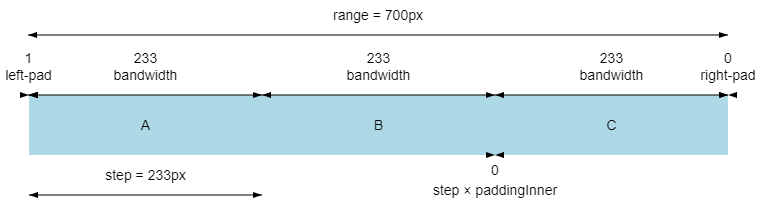
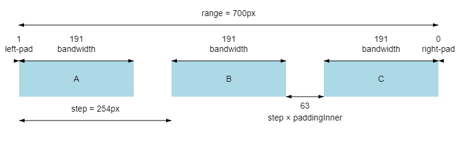

# Nimble Wafer Map Die Margins

## Problem Statement

The Wafer Map displays dies on a canvas inside a circular border with a dynamic die margin size based on the quantity of dies.
The margin size needs to be regulated and specific, therefore an internal parameter will be used to allow the setting of the margin size.

## Links To Relevant Work Items and Reference Material

[Wafer Map Spec](../README.md)

[D3 ScaleBand](https://observablehq.com/@d3/d3-scaleband)

[D3 ScaleQuantile](https://observablehq.com/@d3/quantile-quantize-and-threshold-scales)

## Implementation / Design

The margin will influence the size of the borders between dies and will be represented as a percentage of the die size.
The effective size of the colored die will shrink, but the overall occupied space will remain the same

### ScaleBand

For implementing the die margins we will use `d3`'s `ScaleBand`. This type of scale is already in use when calculating the die `width` and `height`, but a better usage of it will allow for an internal parameter to influence the die margins.

The current implementation uses `ScaleLinear` to position the dies inside the canvas and also allows the mouse coordinates to be inverted back to grid coordinate for the dies.

This scale will be replaced with the `ScaleBand` because using both of them with the margins input will not have the dies displayed in the center of the margins and will cause missalignment.

### ScaleQuantile

The downside of using a `ScaleBand` for positionig dies is that the scale does not have a predefined inversion of values as the `ScaleLinear` does.

Therefore it is needed to create a different scale that mitigates this shortcoming, and the `ScaleQuantile` will serve as an inverted scale for our usage.

## Alternative Implementations / Designs

## Open Issues
