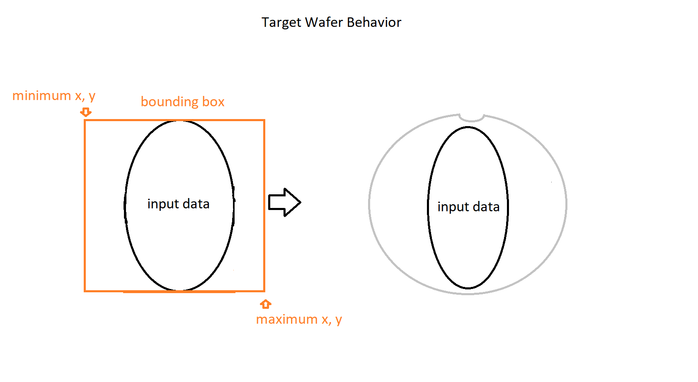

# Nimble Wafer Map Grid Dimensions

## Problem Statement

The Wafer Map displays dies on a canvas inside a circular border based on an internal grid which is calculated by parsing the die data input and looking for the bounding box containing all the values. The dimensions of this box, the coordinates of the minimum and maximum corners, are used to space out the dies in the canvas with the given component dimensions.

This approach of calculating the actual spacing inside the circular border based only on the input data coordinates is a heuristic approach which is limiting the performance of the wafer. Moreover, the calculated grid dimensions can be erroneous if the input data is just a subset of a larger data set, obtained for example by filtering only specific values or just the dies from the center of the wafer. This is causing an unwanted stretching of the wafer or an unexpected zooming which can be confusing especially when displayed near a wafer component which has all the data displayed.

To mitigate these problems, we will reveal four new API inputs which will allow the users to set the grid dimensions themselves, thus saving processing time and correcting inconsistencies generated by the lack of data context.

## Links To Relevant Work Items and Reference Material

-   [Wafer Map Spec](../README.md)
-   [Interactive Wafer Map Improvements](https://dev.azure.com/ni/DevCentral/_wiki/wikis/Stratus/66917/Interactive-Wafer-Map-Improvements)

## Implementation / Design

The new attributes will be described in the component definition with undefined default values. They will be created with change listeners which will trigger the appropriate updates in the wafer.

The inputs will be validated before use. If they are undefined the previous behavior of calculating the values based on the input data will be implemented.

If part of the input data is missing, the wafer will not render, and a new `validity` API will be populated with the reason for the error, `invalidGridDimensions`.

## Alternative Implementations / Designs

An alternative design for these inputs was using them as properties grouped together under a public type. But Nimble discourages using non-primitive types for attributes. Batching updates for input changes in the wafer mitigates the risks of them being set individually

## Open Issues

None.
