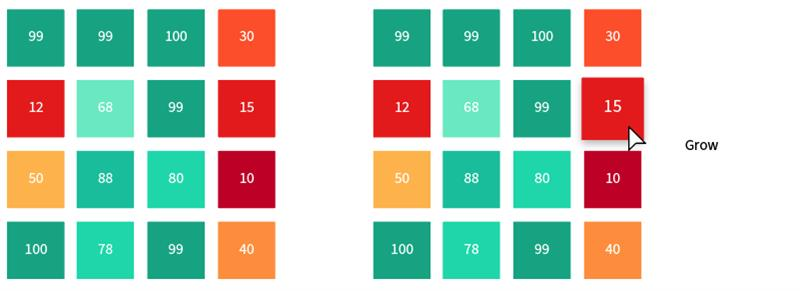

# Nimble Wafer Map Hover Die

## Problem Statement

Besides zooming and panning, the wafer map component needs to support another user interaction, namely hovering.
This interaction will mark the die beneath the cursor to allow the user to emphasize the specific desired die.
More so, the interaction will trigger a custom external event containing the data from the marked die.
This will allow the wafer map to act as a selector for the provided dies
and could be used for displaying a custom tooltip or other external custom features.

## Links To Relevant Work Items and Reference Material

[Wafer Map Spec](../README.md)

## Implementation / Design


### Detection

A new event handler will be created under the event coordinator along with the zoom handler.

This will create mouse move events for the wafer map component which will trigger on hover.

The event handlers will use the mouse position and the canvas '2d' context to filter out use cases.
when the mouse does not hover on top of a colored die.

After passing this filter it will calculate the position of the die relative to the canvas and calculate the
respective coordinates of the die from the input list.

The die coordinates will be then used to locate the original die data in a new Map data structure inside the Data Manager Module.

### Marking

The marking of the hovered die will be implemented using a svg rectangle which will be a part of the template and styled using nimble tokens.

```HTML
<template>
    <div class="wafer-map-container">
        <svg class="svg-root"></svg>
        <canvas></canvas>
        <svg class="hover-layer">
            <rect
                class="hover-rect ${x => x.hoverOpacity}"
                transform="${x => x.hoverTransform.toString()}"
                width="${x => x.hoverWidth}"
                height="${x => x.hoverHeight}"
            />
        </svg>
    </div>
</template>
```

```CSS
    .hover-rect {
        fill:transparent;
        stroke:white;
        outline-style:solid;
        outline-color:green;
    }
    .hover-rect.opaque {
        opacity: '1';
        stroke-width: '2px';
        outline-width: '2px';
    }
    .hover-rect.transparent {
        opacity: '0';
        stroke-width: '0px';
        outline-width: '0px';
    }
```

This rectangle will be hidden when no hovering events are triggered, and will be displayed above the canvas element when they are by changing internal wafer map state of the `hoverOpacity` property.

The rectangle will be resized based on the die dimensions calculated for the input and the zoom transform and influenced by changing the internal `hoverWidth`, `hoverHeight` properties.

The rectangle will be moved to the specific die coordinates detected previously by changing the translate option of the internal `hoverTransform` property.

Because the rectangle will be displayed on top of the canvas it will have all pointer events disabled to not block the zooming and panning events.

The rectangle will be transparent and it will have a colored border and outline to mark the hovered die.

### Custom Events

The hover will trigger a public custom event which will signal a new die was hovered over or the hovering has stopped and will enable the user to subscribe to the hover changes. The event `detail` will contin the mrked die data or will be `undefined` depending on the hover state.
This event will also allow the testing of the hover functionality.

```TS
    const waferMap:WaferMap = document.createElement('nimble-wafer-map');
    waferMap.dies = parsedWaferData.dies;
    ...
    waferMap.addEventListener(
        "die-hover",
        (CustomEvent e) => {
            console.log(e.detail.currentDie);
        },
        false
    );
```

## Alternative Implementations / Designs

Different designs for marking the hovered die were suggested and rejected:

Changing the size of the dies on hover.
This lets us keep the color info and should scale better.

The shrink might run into issue with high density wafers.


The grow might have to overlap neighbors in a high density case but with the drop shadow should still stand out.


Another option is changing the color altogether and displaying the number on top. The downside is you lose the color info for the active die.


The chosen design is similar to the nimble buttons. This makes us consistent with the rest of the design system.

## Open Issues
