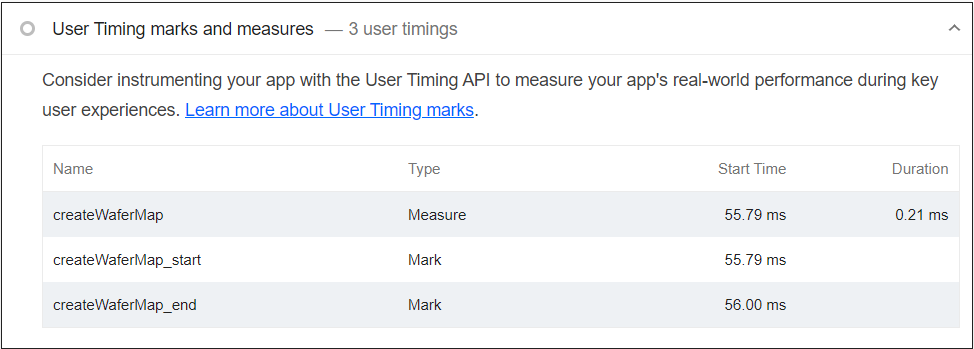

# Rendering++

## Problem Statement

The problem we are addressing is the need for faster rendering in our application. Currently, the rendering process is slow and affects the overall performance of the system. This issue is particularly noticeable when dealing with large or complex datasets. Therefore, we need to design a solution that optimizes the rendering process and improves the user experience.

The proposed design should consider the following factors:

-   Efficiently handle large and complex datasets
-   Minimize rendering time and improve overall performance
-   Measure and improve performance metrics
-   Maintain compatibility with existing design patterns and web standards
-   Avoid introducing new requirements on clients or breaking any APIs
-   Address any potential impact on testing, documentation, security, and other relevant areas

By addressing these challenges, we aim to enhance the rendering capabilities of our application and provide a smoother and more responsive user interface.

### Observed Wafer Component Improvements

The next table records the previous wafer implementation First Time Load with
different dies set sizes:

| FTL    | method      | memory space | attempt 1 | attempt 2 | attempt 3 | size      |
| ------ | ----------- | ------------ | --------- | --------- | --------- | --------- |
| before | queueUpdate | main         | 491ms     | 420ms     | 444ms     | 100k dies |
|        | w/o sorting | main         | 308ms     | 248ms     | 256ms     | 100k dies |
| before | queueUpdate | main         | 7059ms    | 7126ms    | 7469ms    | 1M dies   |
|        | w/o sorting | main         | 3412ms    | 3326ms    | 3484ms    | 1M dies   |

In this table all the computing is done in the main thread. The secondary
records show the benchmarks without the time needed for sorting the dies.

In the following table the benchmarks for the new component with all the
improvements from the POC are recorded:

| FTL   | method      | memory space | attempt 1 | attempt 2 | attempt 3 | size      |
| ----- | ----------- | ------------ | --------- | --------- | --------- | --------- |
| after | queueUpdate | main         | 5.6ms     | 3.5ms     | 4.0ms     | 100k dies |
|       | renderDies  | worker       | 52.1ms    | 58.2ms    | 55.2ms    | 100k dies |
| after | queueUpdate | main         | 20.3ms    | 16.0ms    | 36.0ms    | 1M dies   |
|       | renderDies  | worker       | 490ms     | 476ms     | 511ms     | 1M dies   |
| after | queueUpdate | main         | 126ms     | 104ms     | 124ms     | 10M dies  |
|       | renderDies  | worker       | 3919ms    | 4135ms    | 4071ms    | 10M dies  |

We can see a drastic increase in performance, moreover these benchmarks were
made using a single worker thread, splitting the workload between 2 or 4 will
increase this performance even further.

## Links To Relevant Work Items and Reference Material

[Feature 2391160: Faster Rendering of Large Wafer Maps](https://dev.azure.com/ni/DevCentral/_workitems/edit/2391160)

[Faster Rendering of Large Wafer Maps HLD](https://ni.visualstudio.com/DevCentral/_git/Skyline?path=/docs/design-documents/Ozone/Requirements/Optimize-Wafer-Map-to-Handle-NXP-s-340k-die-per-wafer-data-set/Faster-rendering-of-Large-Wafer-Maps.md&version=GC00f8bb9e698a7310f68fa54395eee63a99cec368&_a=preview)

[Worker Rendering POC](https://github.com/ni/nimble/compare/main...users/munteannatan/scale_and_test_updates)

## Implementation / Design

We will change the whole process of ingesting the data and rendering it in the canvas. The main changes are the data structures used and the process from single threaded to multi threaded. We expect that using better structured data we will gain access time which will improve the rendering and allow distributing the workload if necessary. Moreover, the adoption of thread based processing will free the main thread of the browser to handle user requests and other page events, while allowing us to scale in the future by parallel processing if the need arises.

The detailed plan can be found in the azure HLD [Faster Rendering of Large Wafer Maps HLD](https://ni.visualstudio.com/DevCentral/_git/Skyline?path=/docs/design-documents/Ozone/Requirements/Optimize-Wafer-Map-to-Handle-NXP-s-340k-die-per-wafer-data-set/Faster-rendering-of-Large-Wafer-Maps.md&version=GC00f8bb9e698a7310f68fa54395eee63a99cec368&_a=preview).

The POC is found in this branch [Worker Rendering POC](https://github.com/ni/nimble/compare/main...users/munteannatan/scale_and_test_updates).

### Data Structure and Interface

This is the proposed representation of the wafer information in memory

```TS
class WaferData {
    // the x coordinates of each column of dies
    dieColIndexArray: Int32Array;
    // the lengths of each row of dies
    rowLengthsArray: Int32Array;
    // the y coordinates of each die as a matrix row by row
    dieRowIndexLayer: Int32Array;
    // the value of each die as a matrix row by row
    dieValuesLayer: Int32Array;
    // the highlight state of each die as a matrix row by row
    dieHighlightsLayer: Int8Array;
    // extra values layers
    extraLayers : {
        name: string;
        type: string;
        buffer: TypedArray;
    }[]
}
```

It will be used to store the information and it can be transferred to a worker thread with minimal effort by copying the arrayBuffers and reconstructing the object.

Other benefits include the low access time to the values and the possibility to extend the layers of values.

The previous inputs can be adapted to this new structure to maintain backwards compatibility.

### Rendering

The rendering will also be changed to take place inside a worker thread. The worker will be responsible for parsing each layer of the data set and it will render the information contained with the specific color codes and opacity.

We will be using the [threads.js](https://threads.js.org/) library to spin up the worker and communicate with it.

The worker will function as a state automaton which will need some data after initialization, and it will render everything using an [OffscreenCanvas](https://developer.mozilla.org/en-US/docs/Web/API/OffscreenCanvas).

The main thread will communicate with the worker by signaling any data changes or user events which will trigger full or partial renders.

The strategy for improvement will be gradual. We will try to reuse the existing code as much as possible, but if the performance will not be met, we will improve the existing parsing methods and increase the number of workers.

#### Size Limitations

Because we are reaching out to support very large amounts of data, an issue that is popping out is the limits of the component's canvas size to the amount of displayed data. For example we could find ourselves in the situation to render more dies than there are pixels on the canvas, at least in the zoomed out state.

The solution to this issue is creating a new validity warning or event which will signal this state to the user when the count of individual dies will overtake the size of the canvas. A heuristic which will calculate this based on the zoom level and the component height and width will be implemented and used during data validation.

### Performance Testing

We wish to measure functions performance of wafer map using the existing lighthouse setup paired with windows.performance tools.

Example:

```TS
    const functionName = 'createWaferMap';
    performance.mark(`${functionName}_start`);
    const wafermap = document.createElement('nimble-wafer-map');
    document.body.appendChild(wafermap);
    performance.mark(`${functionName}_end`);
    performance.measure(functionName, `${functionName}_start`, `${functionName}_end`);
```

The example shows how custom markers can be set in the tested code. The result of these user marks can be observed inside lighthouse like in the screenshot bellow.



We wish to extend the existing lighthouse CI testing to include the wafermap component and record various metrics about the performance it has when rendering multiple generated data loads. They will include data ingestion, rendering time, rerendering when user events get triggered and data changes.

These records will be made in a separate web page from the existing performance tests to avoid polluting the results. They will not be preserved over time, each CI record being available for download after build.

Our target goals are:

1. For wafers >200k and <1m die

    1. Initial rendering: <1 second
    1. Zoom/pan actions: <500ms
    1. Configuration changes that don't modify the dataset (e.g. show labels):
       <500ms
    1. Configuration changes that modify the dataset (e.g. replace layers): <1 second

1. For wafers >1m and <10m die
    1. Initial rendering: <10 seconds
    1. Zoom/pan actions: <1 second
    1. Interactions that don't modify the dataset (e.g. show labels): <1 second
    1. Interactions that modify the dataset (e.g. replace layers): <10 seconds

## Alternative Implementations / Designs

### Alternative Data Structures and Interfaces

The above mentioned structure can also be implemented as an [apache arrow](https://arrow.apache.org/docs/js/index.html) table with columns and metadata.

Another option is to break each object property as a separate attribute for the wafer map component.

### Alternative Rendering

Alternatives to the described rendering are splitting the data and canvas and using multiple threads to enhance performance even more.

## Open Issues

_Describe any open issues with the design that you need feedback on before proceeding._
_It is expected that these issues will be resolved during the review process and this section will be removed when this documented in pulled into source._
