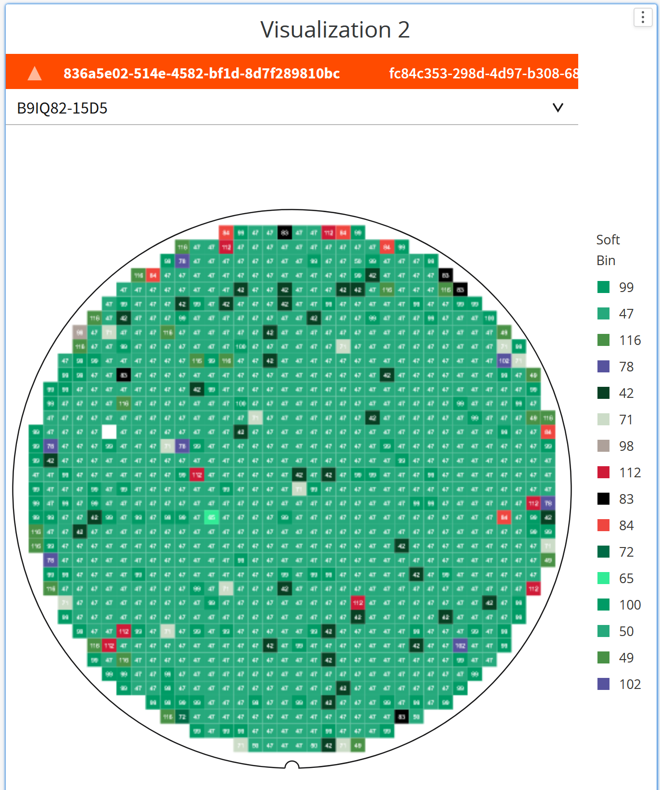

# Rendering++

## Problem Statement

The problem we are addressing is the need for faster rendering in our application. Currently, the rendering process is slow and affects the overall performance of the system. This issue is particularly noticeable when dealing with large or complex datasets. Therefore, we need to design a solution that optimizes the rendering process and improves the user experience.

The proposed design should consider the following factors:

-   Efficiently handle large datasets with multiple layers of metadata
-   Minimize rendering time and improve overall performance
-   Measure and improve performance metrics
-   Maintain compatibility with existing design patterns and web standards
-   Avoid introducing new requirements on clients or breaking any APIs
-   Address any potential impact on testing, documentation, security, and other relevant areas

By addressing these challenges, we aim to enhance the rendering capabilities of our application and provide a smoother and more responsive user interface.

The current datasets for the wafer map component sit at an upper bound of 400k dies. We soon expect that number to increase, maybe even double, which is why we are aiming to provide adequate performance at the 1M threshold and useable performance for higher die counts.

### Observed Wafer Component Improvements

The next table records the previous wafer implementation First Time Load with
different dies set sizes:

| FTL    | method      | memory space | attempt 1 | attempt 2 | attempt 3 | size      |
| ------ | ----------- | ------------ | --------- | --------- | --------- | --------- |
| before | queueUpdate | main         | 491ms     | 420ms     | 444ms     | 100k dies |
|        | w/o sorting | main         | 308ms     | 248ms     | 256ms     | 100k dies |
| before | queueUpdate | main         | 7059ms    | 7126ms    | 7469ms    | 1M dies   |
|        | w/o sorting | main         | 3412ms    | 3326ms    | 3484ms    | 1M dies   |

In this table all the computing is done in the main thread. The secondary
records show the benchmarks without the time needed for sorting the dies.

In the following table the benchmarks for the new component with all the
improvements from the POC are recorded:

| FTL   | method      | memory space | attempt 1 | attempt 2 | attempt 3 | size      |
| ----- | ----------- | ------------ | --------- | --------- | --------- | --------- |
| after | queueUpdate | main         | 5.6ms     | 3.5ms     | 4.0ms     | 100k dies |
|       | renderDies  | worker       | 52.1ms    | 58.2ms    | 55.2ms    | 100k dies |
| after | queueUpdate | main         | 20.3ms    | 16.0ms    | 36.0ms    | 1M dies   |
|       | renderDies  | worker       | 490ms     | 476ms     | 511ms     | 1M dies   |
| after | queueUpdate | main         | 126ms     | 104ms     | 124ms     | 10M dies  |
|       | renderDies  | worker       | 3919ms    | 4135ms    | 4071ms    | 10M dies  |

We can see a drastic increase in performance, moreover these benchmarks were
made using a single worker thread, splitting the workload between 2 or 4 will
increase this performance even further.

Regarding the memory performance, there are improvements as can be seen in the following table:

| FTL      | die count | size     |
| -------- | --------- | -------- |
| baseline | 13 dies   | 49.78MB  |
|          | 1M dies   | 509.81MB |
| 1 thread | 13 dies   | 40.40MB  |
|          | 1M dies   | 44.65MB  |
| 2 thread | 13 dies   | 40.50MB  |
|          | 1M dies   | 44.56MB  |

Using TypedArrays seems to lower the memory needed for large data sets.
The arrays are cloned before being sent to the threads, but this does not seem to impact the needed memory very much.

There are also no noticeable degradations in user experience or interactions with smaller data sets.

## Links To Relevant Work Items and Reference Material

[Feature 2391160: Faster Rendering of Large Wafer Maps](https://dev.azure.com/ni/DevCentral/_workitems/edit/2391160)

[Faster Rendering of Large Wafer Maps HLD](https://ni.visualstudio.com/DevCentral/_git/Skyline?path=/docs/design-documents/Ozone/Requirements/Optimize-Wafer-Map-to-Handle-NXP-s-340k-die-per-wafer-data-set/Faster-rendering-of-Large-Wafer-Maps.md&version=GC00f8bb9e698a7310f68fa54395eee63a99cec368&_a=preview)

[Worker Rendering POC](https://github.com/ni/nimble/compare/main...users/munteannatan/scale_and_test_updates)

## Implementation / Design

We will change the whole process of ingesting the data and rendering it in the canvas. The main changes are the data structures used and the process from single threaded to multi threaded. We expect that using better structured data will lead to time improvements when iterating over values which will improve the rendering and allow distributing the workload if necessary. Moreover, the adoption of thread based processing will free the main thread of the browser to handle user requests and other page events, while allowing us to scale in the future by parallel processing if the need arises.

The detailed plan can be found in the azure HLD [Faster Rendering of Large Wafer Maps HLD](https://ni.visualstudio.com/DevCentral/_git/Skyline?path=/docs/design-documents/Ozone/Requirements/Optimize-Wafer-Map-to-Handle-NXP-s-340k-die-per-wafer-data-set/Faster-rendering-of-Large-Wafer-Maps.md&version=GC00f8bb9e698a7310f68fa54395eee63a99cec368&_a=preview).

The POC is found in this branch [Worker Rendering POC](https://github.com/ni/nimble/compare/main...users/munteannatan/scale_and_test_updates).

### Data Structure and Interface

The best solution to solve the API of the wafermap is to use Apache Arrow as the wafer component API, and Typed Arrays as teh worker API for their iterating performance and transferability to worker threads.

The Public API will be the following:

```TS
import { Table } from 'apache-arrow';
export class WaferMap extends FoundationElement {
...
public diesTable: Table<{
        colIndex: Int32,
        rowIndex: Int32,
        value: Float32,
        tags: Uint32;
        metadata: never;
    }>
...
}
```

This will be the [Apache Arrow](https://arrow.apache.org/docs/js/classes/Arrow_dom.Table.html) table schema.
The row and column indices will be `Int32` columns, the values will be `Float32` columns.
The tags for each die will be represented as a 32 bit mask stored in a `Uint32` column.
The metadata column will be stored in an wildcard typed column.

This approach has the benefits of a row based format that aligns well with the existing public API, as well as a nice public API that easily allows future improvements.

The limits for this approach are the following:

1. There seems to be no support for columns of lists of strings. We decided to overcome this using a bit mask of tags. Another possible solution can be a dynamic number of columns for storing tags, but the performance may suffer.
2. There is no support currently for [searching or filtering the table](https://github.com/apache/arrow/issues/13233). The possible solutions for this are searching by iterating over the whole table, which is not feasible (see 4.) or using a higher level library such as [aquero](https://uwdata.github.io/arquero/). Searching for dies based on their position is crucial for highlighting and sending the highlighted die metadata with the `die-hover` event. The solution we chose is using a custom method for finding rows based on column and row indexes cached as typed arrays. This method provides faster access to row values and metadata and does not induce additional dependencies.
3. The transfer method between the main an worker thread for arrow tables is cumbersome, we would have to use another higher level library [geoarrow](https://github.com/geoarrow/geoarrow-js/blob/main/src/worker/transferable.ts). Fortunately we can skip over this problem by not transferring the tables to the worker.
4. The iteration over stored rows is very slow compared to typed arrays as seen in the table below. This impacts the goals we set for this rendering improvement. The solution to this issue and the transferring issue is splitting the relevant columns from the table (rows, columns, values, tags mask) and messaging them to the worker separately. This can be done with a very small overhead using the [getChild](https://arrow.apache.org/docs/js/classes/Arrow_dom.Table.html#getChild) method and calling [toArray](https://arrow.apache.org/docs/js/classes/Arrow_dom.Vector.html#toArray) on the resulting vector. After being transferred, The buffers can be cached to speed up value access and filtering.

| name                      | duration (ms) [1]  | duration (ms) [2]  | detail                                                                                                    |
| ------------------------- | ------------------ | ------------------ | --------------------------------------------------------------------------------------------------------- |
| typed iterate             | 7.551699995994568  | 6.052600026130676  | iterating over two 1M typed arrays and calculating the sums                                               |
| typed from table iterate  | 6.4953999519348145 | 5.136900067329407  | iterating over two 1M typed arrays from Table columns and calculating the sums (time includes conversion) |
| vector iterate            | 76.4708000421524   | 66.58230006694794  | iterating over two 1M Vectors and calculating the sums                                                    |
| table get() iterate       | 1350.0404000282288 | 1030.582899928093  | iterating over the 1M Table using `table.get(rowIndex)` and calculating the sums                          |
| table [iterator] iterate  | 1091.6706000566483 | 1011.069100022316  | iterating over the 1M Table using the [iterator] and calculating the sums                                 |
| array from table iterate  | 943.0076999664307  | 980.0875999927521  | iterating over the 1M Table after converting `toArray()` and calculating the sums                         |
| vector from table iterate | 965.2465000152588  | 1012.9023000001907 | iterating over the 1M Vector after converting the Table with `makeVector()` and calculating the sums      |

The memory impact is not very significant, amounting to 74.01MB for 1M dies compared with 44.65MB for the previously prototyped API.

### Rendering

An alternate renderer inside a worker thread will be created to live in parallel in the wafer-map :

-   During development the data assigned to the dies property will determine the renderer to use. The current WaferMapDie type will choose the current renderer and the new WaferDataFormat will pick the new renderer.
-   When development is complete the old renderer will be removed and the previous WaferMapDie format will be supported and map to the new format internally.

The render worker:

-   will be responsible for parsing each layer of the data set and it will render the information contained with the specific color codes and opacity.
-   will be using the [comlink](https://github.com/GoogleChromeLabs/comlink) library to communicate with the main thread.
-   will be precompiled by rollup in a library and sent as a Blob to the worker initializer. Workers normally require a separate script file that is downloaded dynamically to run. To avoid the need for dynamically fetched resources and enable static compilation the worker code will be precompiled by rollup in a library and sent as a Blob to the worker.
-   will function as a state automaton which will need some data after initialization, and it will render everything using an [OffscreenCanvas](https://developer.mozilla.org/en-US/docs/Web/API/OffscreenCanvas). `SharedArrayBuffers` can be used to efficiently share memory buffers across multiple web workers but require [strict server configuration](https://developer.mozilla.org/en-US/docs/Web/JavaScript/Reference/Global_Objects/SharedArrayBuffer#security_requirements) to be enabled. As such they will not be leveraged and are not needed to meet the performance targets.

The main thread will communicate with the worker by signaling any data changes or user events which will trigger full or partial renders. We will implement an event queue inside the worker which will batch events together.

The strategy for improvement will be gradual. We will try to reuse the existing code as much as possible, but if the performance will not be met, we will improve the existing parsing methods and increase the number of workers.

Some performance records for multithreaded rendering are recorded in the table bellow:

| FTL      | method     | memory space | attempt 1 | attempt 2 | attempt 3 | size    |
| -------- | ---------- | ------------ | --------- | --------- | --------- | ------- |
| baseline | update     | main         | 4341ms    | 4547ms    | 4359ms    | 1M dies |
| 1 thread | update     | main         | 2.0ms     | 2.0ms     | 0.0ms     | 1M dies |
|          | renderDies | worker       | 392ms     | 372ms     | 399ms     | 1M dies |
| 2 thread | update     | main         | 4.0ms     | 4.1ms     | 4.2ms     | 1M dies |
|          | renderDies | worker       | 204ms     | 207ms     | 209ms     | 1M dies |

#### Size Limitations

Because we are reaching out to support very large amounts of data, an issue that is popping out is the limits of the component's canvas size to the amount of displayed data. For example we could find ourselves in the situation to render more dies than there are pixels on the canvas, at least in the zoomed out state.

The temporary solution to this issue is creating a new validity warning or event which will signal this state to the user when the count of individual dies will overtake the size of the canvas. A heuristic which will calculate this based on the zoom level and the component height and width will be implemented and used during data validation.

The warning will be displayed by the existing warning signaling mechanism used in the Ozone application.


### Performance Testing

We wish to measure functions performance of wafer map using the existing lighthouse setup paired with windows.performance tools.

Example:

```TS
    const functionName = 'createWaferMap';
    performance.mark(`${functionName}_start`);
    const wafermap = document.createElement('nimble-wafer-map');
    document.body.appendChild(wafermap);
    performance.mark(`${functionName}_end`);
    performance.measure(functionName, `${functionName}_start`, `${functionName}_end`);
```

The example shows how custom markers can be set in the tested code. The result of these user marks can be observed inside lighthouse like in the screenshot bellow.


We wish to extend the existing lighthouse CI testing to include the wafermap component and record various metrics about the performance it has when rendering multiple generated data loads. They will include data ingestion, rendering time, rerendering when user events get triggered and data changes.

These records will be made in a separate web page from the existing performance tests to avoid polluting the results. They will not be preserved over time, each CI record being available for download after build.

Our target goals are:

1. We will follow the Chrome Interaction to Next Paint (INP) [guideline](https://web.dev/articles/inp).

    1. An interactions such as a pan or zoom should complete within a "good" INP interval (<200 ms)
    1. If an interaction will take longer the user will see an indication that the interaction is in progress.

1. For wafers >200k and <1m die

    1. Initial rendering: <1 second
    1. Zoom/pan actions: <500ms
    1. Configuration changes that don't modify the dataset (e.g. show labels):
       <500ms
    1. Configuration changes that modify the dataset (e.g. replace layers): <1 second

1. For wafers >1m and <10m die
    1. Initial rendering: <10 seconds
    1. Zoom/pan actions: <1 second
    1. Interactions that don't modify the dataset (e.g. show labels): <1 second
    1. Interactions that modify the dataset (e.g. replace layers): <10 seconds

The current expectation is for a singular wafer component to be displayed on the web page with a large data set. The wafer dataset can be switched without recreating the component. Wafer galleries are handled using static pre-rendered images. Future performance improvements may allow multiple wafer components to be displayed at the same time.

## Alternative Implementations / Designs

### Alternative Data Structures and Interfaces

The alternative to using Apache Arrow tables is an in-house solution:

```TS
class WaferData {
    // the x coordinates of each column of dies
    dieColIndexArray: Int32Array;
    // the lengths of each row of dies
    rowLengthsArray: Int32Array;
    // the y coordinates of each die as a matrix row by row
    dieRowIndexLayer: Int32Array;
    // the value of each die as a matrix row by row
    dieValuesLayer: Float64Array;
    // the highlight  approach is still undecided, we have two options:
    // the highlight state of each die as a matrix; user will have to pre-calculate tags into highlighted conditions.
    dieHighlightsLayer: Int8Array;
    // a 32 bitset array of tags for each die; aligns more closely to the existing public api but limits users to 32 tags.
    dieHighlightsLayer: Int32Array;
    // metadata array for each die; it will not be sent to the worker
    metadata : unknown[]
}
```

Using TypedArrays has the benefit of direct transfer to web workers without structured cloning of the object by transferring the arrayBuffers and reconstructing the object. Other benefits of typedArrays include the low access time when iterating over the values, more memory efficiency and faster direct access to metadata layers values. The previous inputs can be adapted to this new structure to maintain backwards compatibility.

This API will have [optimized byte-array interop from Blazor](https://learn.microsoft.com/en-us/dotnet/core/compatibility/aspnet-core/6.0/byte-array-interop) and should be supported by Angular as a [vanilla javascript feature](https://developer.mozilla.org/en-US/docs/Web/JavaScript/Reference/Global_Objects/ArrayBuffer).

Pros of using Apache Arrow:

-   A row based format that aligns well with the existing public api
-   Well supported and tested format
-   Nice public API to use, we don't have to invent a new format, just document our schema for the arrow tables
-   Designed for large dataset visualizations

Another option is to break each object property as a separate attribute for the wafer map component. This can also lead to increased complexity and confusion for the user which will need to pass several structured objects instead of a singular object.

### Alternative Rendering

Alternatives to the described rendering are splitting the data and canvas and using multiple threads to enhance performance even more. This approach introduces the overhead of managing multiple canvases, splitting the dataset and handling any race conditions, which may not be needed if the single worker approach satisfies the performance requirements.

## Future Implementations / Designs

### Future user interactions

In order to provide a smooth user experience, if the existing event interaction rendering is not sufficiently fast we would implement a more instantaneous response to zoom gestures using bitmap scaling of the canvas while the renderer is updating the final display. This approach will introduce the overhead of switching between the two canvas scaling strategies and may increase the load time for smaller datasets. The process can be optimized by pre-caching fixed zoom levels and switching between them.

Another alternative is to create a point reduction algorithm which will create a reduced set of dies fit to the size limits creating an average, median or other approximation. This approach introduces additional complexity to the rendering and is a lossy compression algorithm, so it's implementation should be carefully considered.

We may also implement an external queue canceling functionality.

## Open Issues

User Indication for [interactions in progress (>200ms)](https://web.dev/articles/inp) possibilities:

-   the wafer-map itself will show a spinner
-   the wafer-map will fire an event to notify the app to present something that work is in progress
-   the wafer-map will use bitmap scaling in addition to a spinner
-   the wafer-map will immediately show the spinner / fire event or only after, for example 200ms
-   the renderer will report progress for larger wait times.
-   the rendering will be done sequentially in animation frames so the user will see the progress at 60Hz

A follow-on HLD update will specify the approved decision.

_Describe any open issues with the design that you need feedback on before proceeding._
_It is expected that these issues will be resolved during the review process and this section will be removed when this documented in pulled into source._
