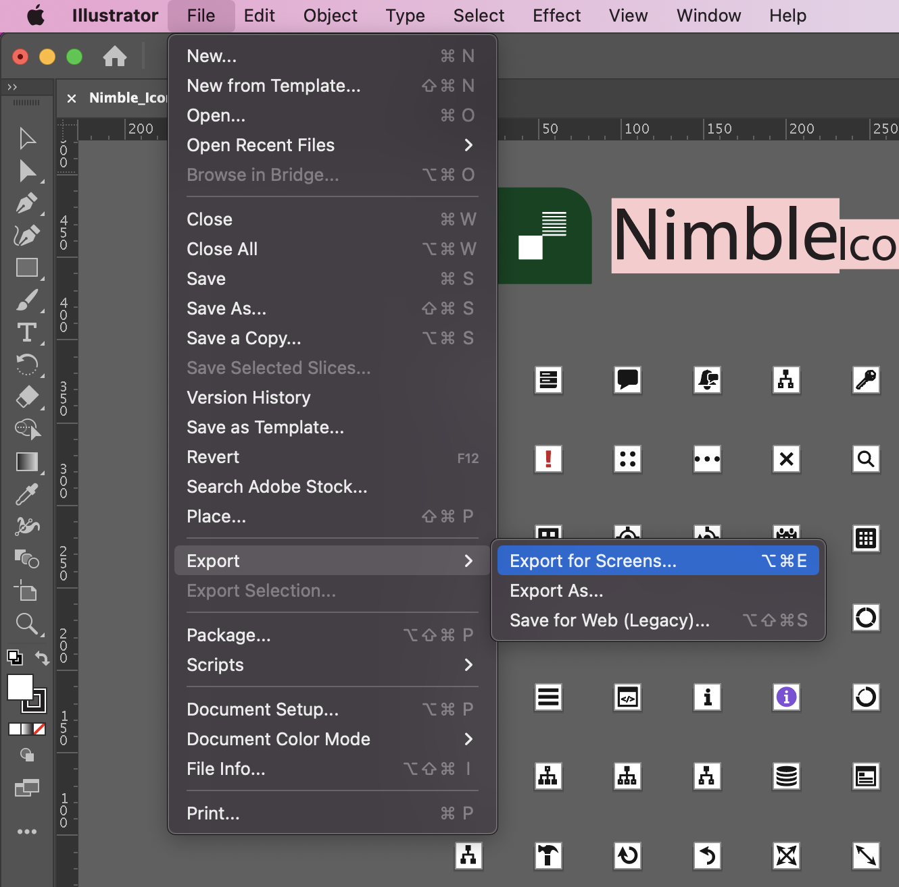
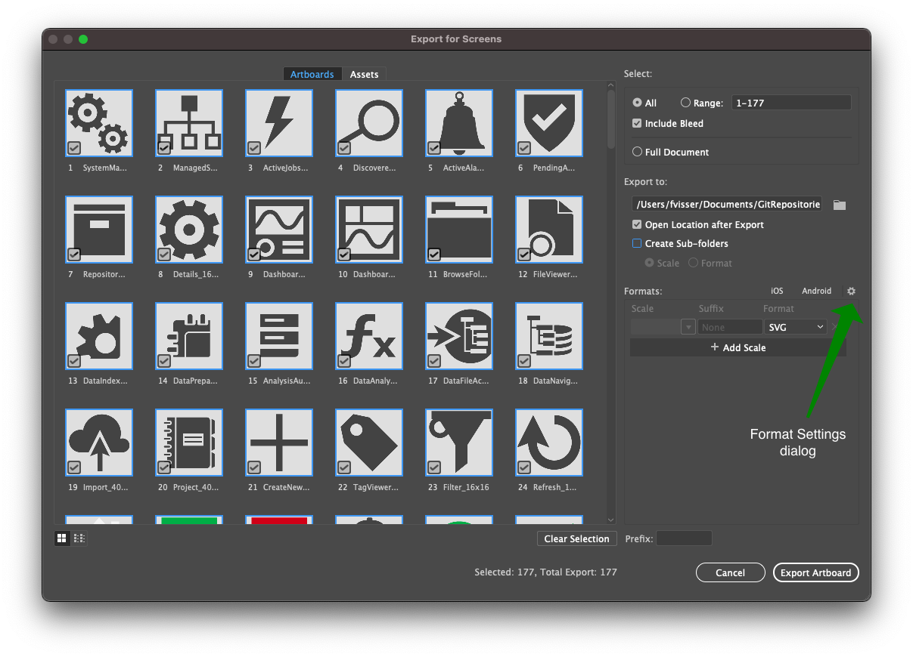
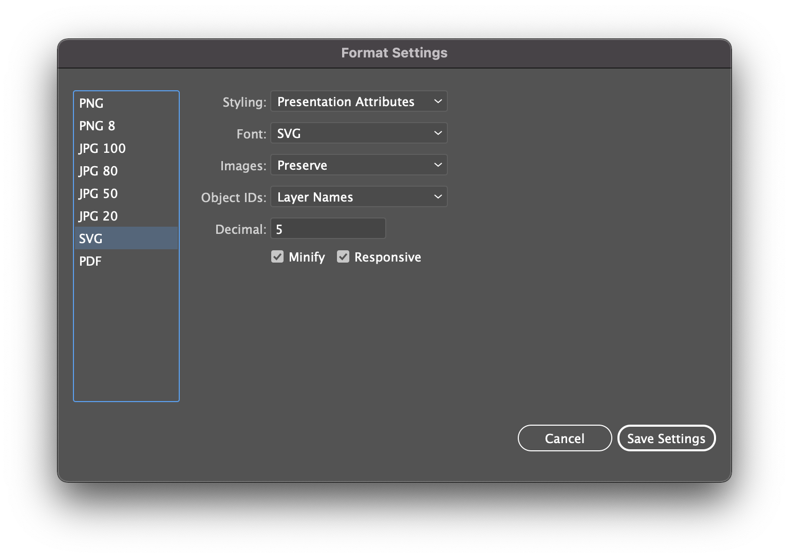
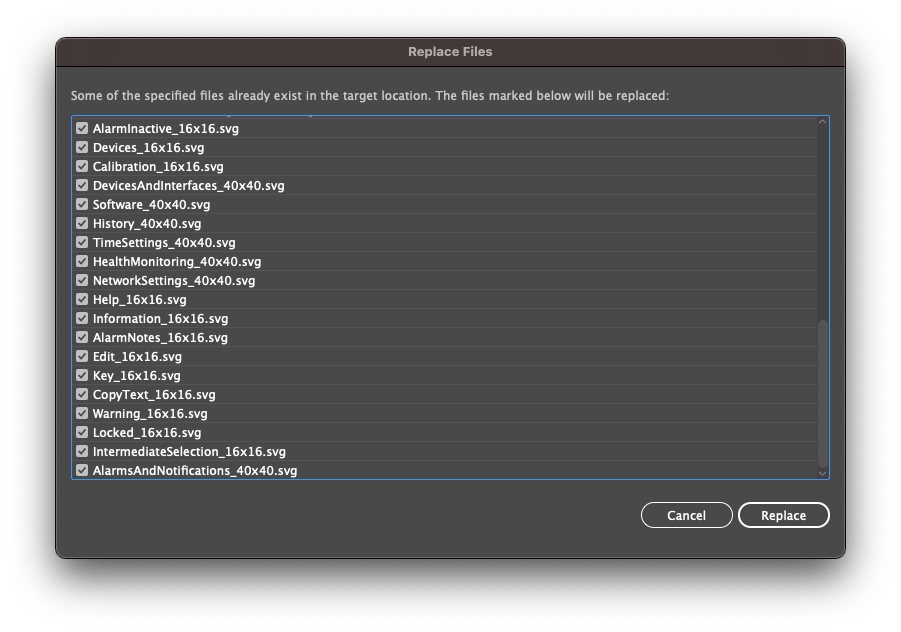
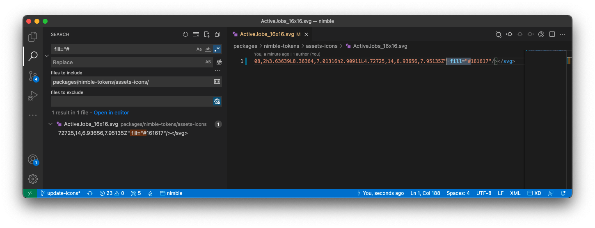

# Contributing to Nimble Tokens

## Repository layout

| Folder               | Description                             |
| -------------------- | --------------------------------------- |
| build                | Build scripts for generating files      |
| data                 | _Managed by Adobe XD DSP plugin_        |
| dist/fonts           | Fonts for use in applications           |
| dist/icons           | Icons for use in applications           |
| dist/styledictionary | _Managed by Adobe XD DSP plugin_        |
| docs                 | Files used by the documentation         |
| NimbleTokens         | Project for building the Nuget package  |
| source/icons         | Illustrator files for editing icons     |

## Getting started

1. Build the monorepo, see [Getting Started](/CONTRIBUTING.md#getting-started)
2. Ensure you have the [Adobe XD extension for Visual Studio Code](https://marketplace.visualstudio.com/items?itemName=Adobe.xd&ssr=false#overview) installed.

## Editing Tokens

New tokens are added to this package with the [Adobe XD Visual Studio extension](https://marketplace.visualstudio.com/items?itemName=Adobe.xd&ssr=false#overview).

The source of truth for the colors, fonts, and component design tokens in this repository is an Adobe XD [Design Library file](https://xd.adobe.com/view/33ffad4a-eb2c-4241-b8c5-ebfff1faf6f6-66ac/) maintained by the Visual Design team.

For changes to any token values, work with the Visual Design team to update the library, and then perform the following steps:

1. Open the XD extension (invoke [Show All Commands](https://code.visualstudio.com/docs/getstarted/keybindings#_navigation) and execute command `XD: Toggle Adobe XD Panel`) and load the nimble-tokens-dsp package by selecting the `nimble-tokens` folder.
2. Click the **DSP Setting** button (bottom left). If the button is not available, open the XD extension settings to confirm that the `XD: Global Editor` setting is **checked** for both user and workspace.
3. Scroll to the bottom of the DSP Setting page and click the **Re-import** button to update the CC LIBRARY LINK.
4. Save the settings change.
5. Click the **Start Editing** button and then the **Stop Editing** button to trigger the StyleDictionary token build.
6. Commit these changes to the repo.

For any token metadata changes (e.g. documentation, code snippets, etc.):

1. Follow step 1 above.
2. Click the **Start Editing** button and make your changes.
3. Click the **Stop Editing** button to trigger a token build.
4. Commit these changes to the repo.

## Updating icons

### Extract icons from Adobe Illustrator

These steps require access to Adobe Illustrator and Perforce so will typically be completed by Brandon O'Keefe or Fred Visser.

1. Get the latest copy of the icon source file from NI internal Perforce at `\NIComponents\VisualDesign\ProductionAssets\DiagramPaletteAssets_XML\SystemLink\trunk\20.0\source\Nimble_Iconography.ai`.
2. Copy the icon source file from Perforce to `source/icons/Nimble_Iconography.ai` and include it in your PR.
3. Export high-quality, optimized SVG files from the icon source file, by using the **Export for Screens…** workflow within Adobe Illustrator to export SVG files:

   1. Choose **File » Export » Export for Screens…**

      

   2. In the Export for Screen prompt, confirm that files will be exported to the `dist/icons/svg` folder, and that the remaining settings match the screenshot below.

      

   3. Confirm that the SVG settings match the screenshot below.

      

   4. Choose to replace any existing files in the `dist/icons/svg` folder.

       
4. Proceed to the steps below or [file an issue]() requesting that the Nimble team perform them. If filing an issue, attach the new and modified SVG files to the issue.

### Adding icons to Nimble

1. Search for all `<defs>.*</defs>` tags in the exported `.svg` files (in the `packages/nimble-tokens/dist/icons/svg` directory), and remove them. This removes all color from the `.svg` files and allows us to dynamically change the fill color.

      

2. Confirm the new icon files will build correctly by running: `npm run build -w @ni/nimble-tokens` & `npm run build -w @ni/nimble-components`.
3. Add metadata for the new icons to `nimble-components\src\icon-base\icon-metadata.ts`.
4. Generate and build icon components by running `npm run build -w @ni/nimble-components`.
5. Preview the built files by running: `npm run storybook -w @ni/nimble-components`, and review the **Icons** story to confirm that your changes appear correctly.
6. Publish a PR with your changes. If there are any new icons, set `changeType` and `dependentChangeType` to minor in the beachball change file.
