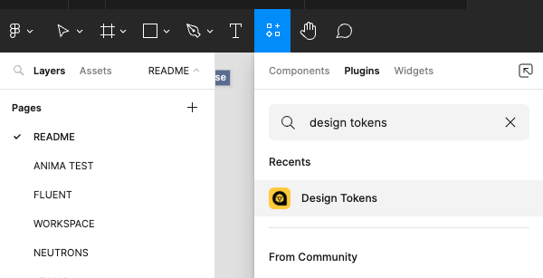
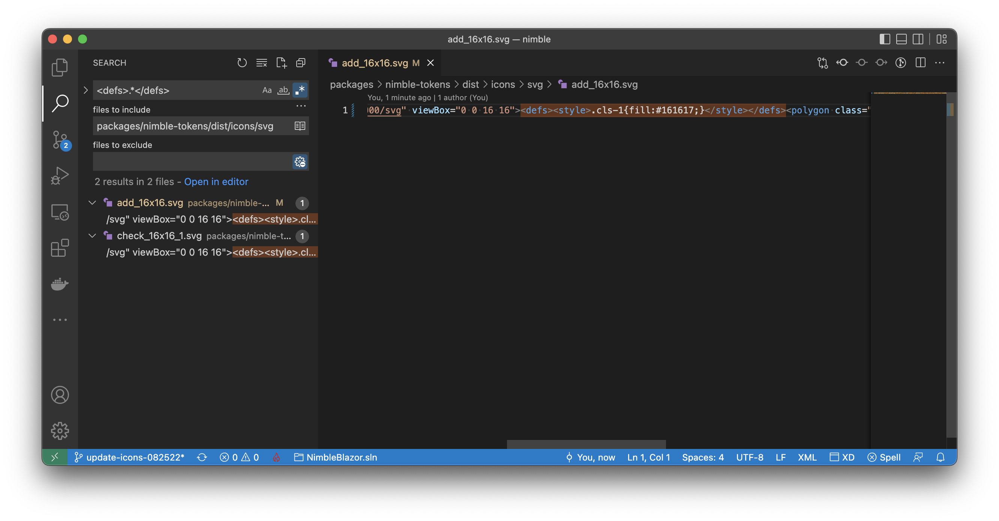

# Contributing to Nimble Tokens

## Repository layout

| Folder               | Description                             |
| -------------------- | --------------------------------------- |
| build                | Build scripts for generating files      |
| data                 | _Managed by Adobe XD DSP plugin_        |
| dist/fonts           | Fonts for use in applications           |
| dist/icons           | Icons for use in applications           |
| dist/styledictionary | _Managed by Adobe XD DSP plugin_        |
| docs                 | Files used by the documentation         |
| NimbleTokens         | Project for building the Nuget package  |
| source/icons         | Illustrator files for editing icons     |

## Getting started

1. Build the monorepo, see [Getting Started](/CONTRIBUTING.md#getting-started)
2. Ensure you have the [Adobe XD extension for Visual Studio Code](https://marketplace.visualstudio.com/items?itemName=Adobe.xd&ssr=false#overview) installed.

## Editing Tokens

Most tokens are sourced in a Figma design spec, stored in this repository in the [Style Dictionary](https://amzn.github.io/style-dictionary/#/) JSON format, and built into platform-specific output.

### Exporting tokens from Figma to Style Dictionary format

1. Ensure you have edit access to [Nimble Styles](https://www.figma.com/file/PO9mFOu5BCl8aJvFchEeuN) in Figma. If you don't have access you can ask someone else to perform these steps or request access from Brandon O'Keefe. You will need a free Figma account associated with your ni.com email address.
2. Open the above document in Figma (web or desktop client is fine).
3. In the Resources menu, select the Plugins tab and find the [Design Tokens](https://www.figma.com/community/plugin/888356646278934516/Design-Tokens) plugin. If this menu isn't visible you probably don't have edit access to this Figma document.
   
4. Select **Run** then **Export Design Token File**.
5. Select which tokens you want to export then click **Save and Export** and enter the JSON file name.
   - for color tokens, select **Colors** and name the file `colors.json`.
   - for font tokens, select **Font Styles** and name the file `fonts.json`.
   - for size tokens, select **Sizes** and name the file `sizes.json`.
6. Note the location of the exported JSON file(s) (typically your Downloads folder) and proceed to the next section to import the file into this repo.

### Modifying tokens in Nimble

Tokens are generated using the [Style Dictionary](https://amzn.github.io/style-dictionary/#/) build system, which transforms platform-agnostic token definition files into platform-specific output. These JSON definition files are the source of truth for the colors, fonts, and component design tokens in this repository. To modify the generated tokens, complete these steps:

1. Edit the JSON files in `source/styledictionary/properties`. This will typically be done by copying exported JSON from Figma (see above).
   - *Note: If you are adding tokens manually, contact Brandon O'Keefe to add corresponding values to Figma.*
2. Rebuild the generated token files by running the repository's build command, `npm run build`.
3. Test your changes locally. Ensure that new tokens render in Storybook correctly and that usages are updated if any tokens changed names.
4. Consider adding [`nimble-components` theme-aware tokens that use the new values](/packages/nimble-components/README.md#theming).
5. Create a PR using the normal process.

## Updating icons

### Extract icons from Adobe Illustrator

These steps require access to Adobe Illustrator and Perforce so will typically be completed by Brandon O'Keefe, Fred Visser, or another designer.

1. Get the latest copy of the icon source file from NI internal Perforce at `//NIComponents/VisualDesign/ProductionAssets/DiagramPaletteAssets_XML/Nimble/trunk/20.0/source/Nimble_Iconography.ai`.
2. Export high-quality, optimized SVG files from the icon source file, by using the **Export for Screens…** workflow within Adobe Illustrator to export SVG files:

   1. Choose **File » Export » Export for Screens…**

      

   2. In the Export for Screen prompt, confirm that files will be exported to the `dist/icons/svg` folder, and that the remaining settings match the screenshot below.

      

   3. Confirm that the SVG settings match the screenshot below.

      

   4. Choose to replace any existing files in the `dist/icons/svg` folder.

       
3. Proceed to the steps below or [create a user story](https://github.com/ni/nimble/issues/new/choose) requesting that the Nimble team perform them. If filing an issue, attach the new and modified SVG files and also `Nimble_Iconography.ai` to the issue.

### Adding icons to Nimble

1. In a new branch, copy the Illustrator file to `source/icons/Nimble_Iconography.ai` and the SVG files to `dist/icons/svg`.
2. Search for all `<defs>.*</defs>` tags in the exported `.svg` files and remove them. This removes all color from the `.svg` files and allows us to dynamically change the fill color.

      

3. Confirm the new icon files will build correctly by running: `npm run build -w @ni/nimble-tokens`.
4. Generate and build icon components by running `npm run build -w @ni/nimble-components`. This step will report an error at this point but is necessary to enable the next step.
5. Add metadata for the new icons to `nimble-components\src\icon-base\icon-metadata.ts`.
6. Run `npm run build -w @ni/nimble-components` again. It should now succeed.
7. Preview the built files by running: `npm run storybook -w @ni/nimble-components`, and review the **Icons** story to confirm that your changes appear correctly. Inspect the icons in each **Severity** and ensure their color changes.
8. Publish a PR with your changes. If there are any new icons, set `changeType` and `dependentChangeType` to minor in the beachball change file.
