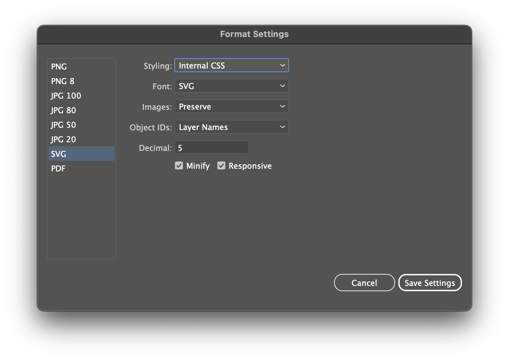

# Contributing to Nimble Tokens

## Repository layout

| Folder       | Description                                                   |
| ------------ | ------------------------------------------------------------- |
| assets       | _Managed by Adobe XD DSP extension_                              |
| assets-fonts | Fonts for nimble-components                                   |
| assets-icons | SVG assets produced by NI visual designers                    |
| data         | _Managed by Adobe XD DSP extension_                              |
| dist         | _Managed by Adobe XD DSP extension_                              |
| dist-\*      | Build output for icons and fonts that need further processing |
| source       | Icon build scripts and font face definitions                  |

## Editing Tokens

New tokens are added to this package with the Adobe XD Visual Studio extension.

The source of truth for the colors, fonts, and component design tokens in this repository is an Adobe XD [Design Library file](https://xd.adobe.com/view/8ce280ab-1559-4961-945c-182955c7780b-d9b1/screen/d022d8af-22f4-4bf2-981c-1dc0c61afece/) maintained by the Visual Design team.

For changes to any token values, work with the Visual Design team to update the library, and then perform the following steps:

1. Ensure you have the [Adobe XD extension for Visual Studio Code](https://marketplace.visualstudio.com/items?itemName=Adobe.xd&ssr=false#overview) installed.
2. Open the XD extension (invoke [Show All Commands](https://code.visualstudio.com/docs/getstarted/keybindings#_navigation) and execute command `XD: Toggle Adobe XD Panel`) and load the nimble-tokens-dsp package by selecting the `nimble-tokens` folder.
3. Click the **DSP Setting** button (bottom left). If the button isn't available, open the XD extension settings to confirm that the `XD: Global Editor` setting is **checked** for both user and workspace.
4. Delete the `*.svg` files in the `nimble-tokens/assets` folder. The import process will populate this folder, but won't remove unnecessary files.
5. Scroll to the bottom of the DSP Setting page and click the **Re-import** button to update the CC LIBRARY LINK.
6. Save the settings change.
7. Click the **Start Editing** button and then the **Stop Editing** button to trigger a token build.
8. Commit these changes to the repo.

For any token metadata changes (e.g. documentation, code snippets, etc.):

1. Follow steps 1-3 above.
2. Click the **Start Editing** button and make your changes.
3. Click the **Stop Editing** button to trigger a token build.
4. Commit these changes to the repo.

## Updating icons

1. Export high-quality, optimized SVG files from the `source/Nimble_Iconography.ai` icon source file, by using the **Export for Screens…** workflow within Adobe Illustrator to export SVG files:

   1. Choose **File » Export » Export for Screens…**

      

   2. In the Export for Screen prompt, confirm that files will be exported to the `nimble-tokens/assets-icons/` folder, and that the remaining settings match the screenshot below.

      

   3. Confirm that the SVG settings match the screenshot below.

      

   4. Choose to replace any existing files in the `assets-icons` folder.

      

2. Confirm the new icon files will build correctly by running: `npm run build -w @ni/nimble-tokens`.
3. Preview the built files by running: `npm run storybook -w @ni/nimble-components`, and review the **Icons** stories to confirm that your changes appear correctly.
