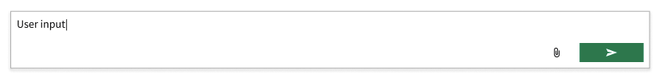

# Chat components

## Overview

This spec describes a set of components that can be used to compose a chat interface. This includes:

- chat message: a single entry in a chat conversation, including some content and metadata about the message
- chat conversation: a collection of messages that are laid out to convey the order the messages were sent
- chat input: a text input, button, and related components for users to compose and send new messages

### Background

Some Intelligent Test application teams are beginning development on chat interfaces in early 2025. Developers from one of those teams will build these components as their first Nimble contribution.

Initial designer-vetted visual designs exist in [Nimble_Components Figma](https://www.figma.com/design/PO9mFOu5BCl8aJvFchEeuN/Nimble_Components?node-id=12342-81782&node-type=canvas&t=L5GvLaC3injrqWrR-0).

Initial application interaction designs exist in [a separate Figma](https://www.figma.com/design/G2KimFrkqrHMHQIFvKVDC4/AI-Chat-in-LabVIEW-TestStand-Specs).

There is not yet a detailed Nimble interaction design specification for these components.

A [Blazor implementation of the chat input component](https://dev.azure.com/ni/DevCentral/_git/ASW?path=%2FSource%2FMeasurementServices%2FAiAssistants%2FControls%2FComponents%2FInputTextArea.razor&version=GBfeatures%2FAIAssistants&_a=contents) exists in a client application.

#2551 can be resolved with the addition of the input component.

### Containing Library

These components will initially be added to Spright. Per [Spright contributing guidelines](/packages/spright-components/CONTRIBUTING.md):

1. there is not yet an approved interaction design
2. we are unsure if the components are sufficiently atomic or general purpose to belong in Nimble
3. there is a short development timeline so it may be necessary to defer fulfilling other Nimble requirements like accessibility and support for all frameworks

### Non-goals

The components will only provide the presentation layer, not logic for interacting with each other or any service to add messages to a conversation.

The message component will allow slotting arbitrary content, but any efforts to add content types to Nimble are out of scope of this document. For example, adding capabilities to the rich text viewer or adding styling for specific content types.

### Features

#### Chat message

The `spright-chat-message` has the following slot elements.

1. `default` slot displays arbitrary slotted content. For example: text, rich text, buttons, images, or a spinner.
1. `footer-actions` slot which is used to add action buttons below the main content.
1. `end` slot which is used to add text buttons. They are below any action buttons.

Nimble will set the height of the action buttons to `$ni-nimble-control-slim-height`. All action buttons must meet the following criteria

1. They are `nimble-button`s or any other button variant (toggle button, menu button, etc)
1. The `appearance` attribute is set to `ghost`
1. The `content-hidden` attribute is set to `true`
1. They contain only Nimble icons

All end text buttons must meet the following criteria

1. They are `nimble-button`s
1. The `apperance` attribute is set to `block`
1. The buttons only have text

The component also contains the following features:

1. Layout content to the right, center, or left of parent container depending on metadata about who sent the message.
1. Size based on content size with maximum width (but not height) based on parent's width.
1. Change the styling of the message depending on metadata about who sent the message. For example: render user messages in a bubble with the tail pointing to the right but render system messages with no styling.

#### Chat conversation

1. Lays out messages vertically based on their order.
1. Displays a vertical scrollbar if there are more messages than fit in the height allocated to the conversation.
1. Only appearance of its own is to set a background color.

#### Chat input

##### In scope

1. Accepts text input in a text area 
    - the text area height is a single line initially but grows its height to fit the entered text up to a limit
    - the text area has a configurable placeholder
1. Includes a "Send" button for the user to submit the current input text
    - fires an event containing the current input content and then clears the content and sets keyboard focus back to the input
    - pressing Enter while the text area has focus will behave the same as clicking "Send"
    - pressing Shift-Enter will create a newline
    - the button is disabled and Enter has no effect if the input text is empty
1. Styling for default, focus, and rollover states

##### Future work

1. Includes a "Stop" button for the user to abort a sent message
1. Includes slots for specifying additional content like a button for attaching files and chips for viewing/clearing attached files
1. Displays errors via the standard red `!` icon and error text

### Risks and Challenges

These components are competing against possible implementations within applications. Depending on who implements these components, the overhead of learning the Nimble repo's tech stack could introduce a small risk.

### Prior Art/Examples

**Screenshot of Figma design of message and conversation component (light mode)**  


**Screenshot of Figma design of chat input component (light mode)**  


**Screenshot of Figma design of chat components embeded within larger pane (dark mode)**  


---

## Design

### Examples

#### Text conversation example

```html
<spright-chat-conversation>
    <spright-chat-message message-type="inbound">
        Hi, how can I help?
    </spright-chat-message>
    <spright-chat-message message-type="outbound">
        I need to analyze my data to find anomalies.
    </spright-chat-message>
    <spright-chat-message message-type="system">
        <nimble-spinner></nimble-spinner>
    </spright-chat-message>
</spright-chat-conversation>
```

#### Rich text message example

```html
<spright-chat-conversation>
    <spright-chat-message message-type="inbound">
        <nimble-rich-text-viewer id="welcome"></nimble-rich-text-viewer>
    </spright-chat-message>
</spright-chat-conversation>
```

```js
const richText = document.querySelector('#welcome');
richText.markdown = 'Welcome **Homer**, how can I help?';
```

#### Prompt buttons message example

```html
<spright-chat-message message-type="inbound">
    <nimble-button appearance="block" slot="end">Help with my taxes</nimble-button>
    <nimble-button appearance="block" slot="end">Provide me some life advice</nimble-button>
</spright-chat-message>
```

#### Input example

```html
<spright-chat-input placeholder="Ask Nigel">
</spright-chat-input>
```

### API

#### Message

- _Component Name_ `spright-chat-message`
- _Props/Attrs_
    - `message-type = "inbound" | "outbound" | "system"`
- _Methods_
- _Events_
- _CSS Classes and CSS Custom Properties that affect the component_
- _How native CSS Properties (height, width, etc.) affect the component_
    - A message will grow its width to fit its content, up to a maximum width.
    - A message will grow its height to fit its content, with no maximum height.
    - Clients could override this behavior but we don't anticipate use cases for doing so when the message is used within a conversation
- _Slots_
    - `footer-actions`
        - Action buttons to display after the main content.
    - `end`
        - Buttons with text that are displayed at the bottom after any action buttons.
    - `(default)`
        - arbitrary content can be added to the default slot to be displayed within the message

#### Conversation

- _Component Name_ `spright-chat-conversation`
- _Props/Attrs_
- _Methods_
- _Events_
- _CSS Classes and CSS Custom Properties that affect the component_
- _How native CSS Properties (height, width, etc.) affect the component_
    - Clients can size the conversation using normal CSS rules.
    - The conversation will show a scrollbar if content overflows vertically.
    - The conversation will have a minimum width that clients are discouraged from overriding.
- _Slots_
    - chat messages are added to the default slot. The DOM order of the messages controls their screen order within the conversation (earlier DOM order => earlier message => top of the conversation)

#### Input

- _Component Name_ `spright-chat-input`
- _Props/Attrs_
   - `placeholder` - text to display in the text area when no text is available
   - `send-button-label` - text to use for a `title` and ARIA attributes on the send button. See Accessibility section for more info.
- _Methods_
- _Events_
   - `send` - emitted when the user clicks the button or presses Enter with text present. Includes `ChatInputSendEventDetail` which is an object with a `text` field containing the input contents.
- _CSS Classes and CSS Custom Properties that affect the component_
- _How native CSS Properties (height, width, etc.) affect the component_
    - Clients can set the input width using normal CSS rules. The input will have a default minimum width that clients are discouraged from overriding.
    - The input will have a default height to fit one line of text and will grow its height to fit more lines, up to a limit. After that limit. After that limit it will show a vertical scrollbar.
- _Slots_

### Anatomy

#### Message

A message is simply a `div` which will styled with background / border / rounded corners and the default slot for the message contents.

```html
<template>
    <div class="root">
        ${startSlotTemplate(context, definition)}
        <section class="message-content">
            <slot></slot>
        </section>
        <section>
            <slot class="footer-actions" name="footer-actions"></slot>
        </section>
        ${endSlotTemplate(context, definition)}
    </div>
</template>
```

#### Conversation

Other than setting a background, a conversation has no appearance of its own and simply contains the default slot for messages.

```html
<template>
    <slot></slot>
</template>
```

#### Input

The input contains a native `textarea` and a `nimble-button`. The code below is simplified to omit some classes / refs and ARIA info.

Most of the styling will use standard Nimble tokens and CSS layout techniques.

One notable styling decision is that we plan to use [`field-sizing: content;`](https://developer.mozilla.org/en-US/docs/Web/CSS/field-sizing)
to implement the ability to grow the height of the text area as the user types. This
[is not yet supported in Firefox or Safari](https://developer.mozilla.org/en-US/docs/Web/CSS/field-sizing#browser_compatibility).
Initially clients will either use modern versions of Chromium-based browsers or will only leverage this component behind a feature flag. If
that changes we will revisit this decision and consider implementing a JavaScript-based resizing solution.
        

```html
<div class="container">
    <textarea
        placeholder="${x => x.placeholder}"
        rows="1"
        @keydown="${(x, c) => x.textAreaKeydownHandler(c.event as KeyboardEvent)}"
        @input="${x => x.textAreaInputHandler()}"
    ></textarea>
    <${buttonTag}
        appearance="block"
        appearance-variant="accent"
        ?disabled=${x => x.disableSendButton}
        @click=${x => x.sendButtonClickHandler()}
    >
        <${iconPaperPlaneTag} slot="start"><${iconPaperPlaneTag}/>
    </${buttonTag}>    
</div>
```

### Native form integration

Native form integration is not needed for these components.

### Angular integration

Angular wrappers will be created for every component.

### Blazor integration

Blazor wrappers will be created for every component.

### Visual Appearance

Initial designer-vetted visual designs exist in [Nimble_Components Figma](https://www.figma.com/design/PO9mFOu5BCl8aJvFchEeuN/Nimble_Components?node-id=12342-81782&node-type=canvas&t=L5GvLaC3injrqWrR-0).

---

## Implementation

### States

Chat message and conversation don't support any states.

Chat input supports a default state, a rollover state, and a focus state. These impact the visual appearance similar to other controls. More info available in the Figma spec.

### Accessibility

#### Messages

Only keyboard navigation has been evaluated. The desired behavior is for each message's action buttons to be a single tab stop, with navigation between a message's action buttons accomplished using arrow keys. This should be achieved by placing the items within a `nimble-toolbar`, however the `nimble-toolbar` does not yet detect content in nested slots (see #2571). For scoping reasons the content will not initially be placed in a toolbar and thus each button will be a tab stop. Once that issue is addressed it should be possible to add a toolbar and achieve the desired behavior without breaking clients.

Buttons placed in the `end` slot should each be their own tab stop and thus will not be placed in a toolbar.

The design spec includes a proposal to add another "Edit" button to the left of some messages when the user hovers over the message. The button would be a tab stop and would become visible when keyboard focused. This work is currently out of scope.

Other aspects of accessibility have not yet been evaluated.

#### Input

The text field and button will each be keyboard focusable. This will be reflected visually to the user in accordance with the design spec.

The Design team has requested a non-standard appearance for the send button: icon-only but rectangular shape. Nimble buttons support square icon-only buttons with an accessible label via `content-hidden` or rectangular buttons with text content visible. We will achieve the desired implementation by using a `nimble-button` with the following settings:
 - adding icon content in the `start` slot 
 - not setting `content-hidden`
 - providing no text content
 - setting `aria-label` to the value of `send-button-label`
 - setting an explicit width

The text area will have an ARIA role of `textbox` similar to other Nimble text input components.

_Consider the accessibility of the component, including:_

- _Keyboard Navigation and Focus_
- _Form Input and Autofill_
- _Use with Assistive Technology. For example:_
    - _All components should define a role and support labels / being labelled so that assistive technology can identify them_
    - _The implications shadow dom might have on how roles and attributes are presented in the accessibility tree_
    - _Components which delegate focus require all global ARIA attributes to be enumerated_
    - _Components should either follow an existing [ARIA Pattern](https://www.w3.org/WAI/ARIA/apg/patterns/) or provide thorough research indicating why a new pattern is appropriate. Research should include sources like [Open UI Community Group](https://github.com/openui/open-ui) and other popular design systems._
- _Behavior with browser configurations like "Prefers reduced motion"_
- _Support for standard link behaviors if the component is an anchor or contains an anchor. These behaviors are enumerated in the [anchor-patterns story](/packages/nimble-components/src/patterns/anchor/tests/anchor-patterns.mdx). The story should be updated to include the new component._

### Mobile

Component layout will be tested at small screen sizes. The plans for content sizing and showing scrollbars should allow for adequate mobile layout. But initially there will be no specific testing of mobile behaviors as initial clients are desktop applications.

### Globalization

The content is provided by applications so they are responsible for localization.

Defining the behavior for RTL languages is initially out of scope. But the API can easily be extended to support changing the layout for an RTL language when that is desired.

### Security

Applications are responsible for the security of the content added to messages. These components will not provide any validation or sanitization.

### Performance

Applications should consider the performance of conversations with large, complex, or numerous messages. Applications can add virtualization features like a "load more messages" button with no change to the chat components. Other virtualization features like loading more messages when scrolling near the end of a conversation should be trivial to add but are out of scope of this document.

### Dependencies

No new dependencies.

### Test Plan

Typical unit tests and Chromatic visual tests. Spright maintains the same testing standards as Nimble.

### Tooling

This is likely the first Spright components most applications will adopt so they will need to add a new dependency. Blazor applications should follow [the Spright Blazor README](https://github.com/ni/nimble/blob/spright-chat-components/packages/blazor-workspace/SprightBlazor/README.md#getting-started) to set up this dependency.

### Documentation

Standard Storybook documentation. Since these are a Spright components we should ensure the documentation conveys the component status and gaps.

There are parallel efforts to standardize and document other aspects of chat applications (for example the tone and language used by automated conversation participants) that are out of scope of this document.

---

## Open Issues

These issues will not be resolved with the current planned work as they apply to the Chat Input Future Work features. They are captured 

1. Styling questions:
   - how to clip text? currently visible in the padding area
   - resize `field-sizing` only works on Chromium
1. 
