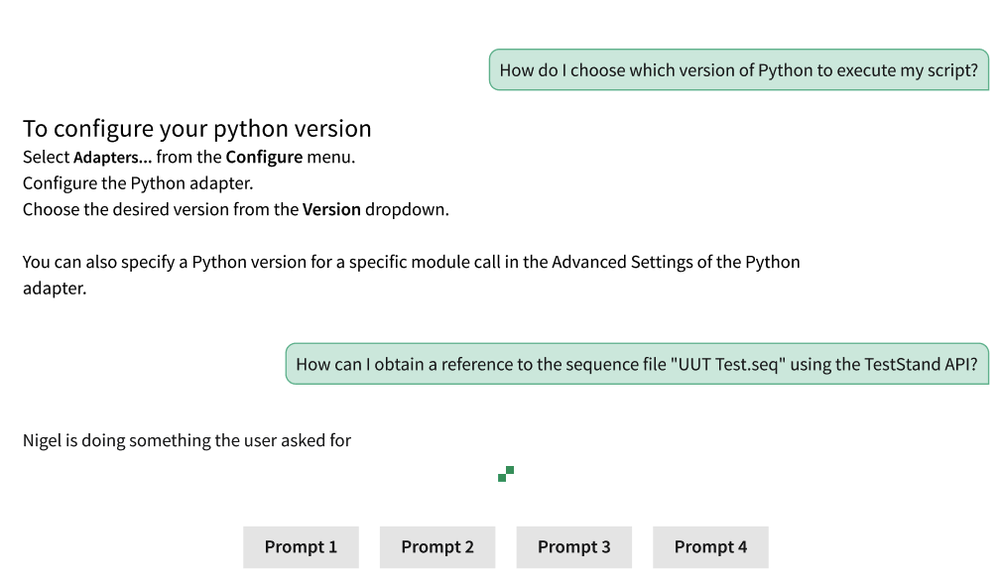
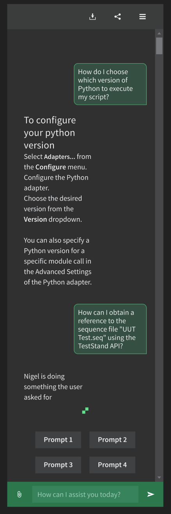

# Chat components

## Overview

This spec describes a set of components that can be used to compose a chat interface. This includes:

- chat message: a single entry in a chat conversation, including some content and metadata about the message
- chat conversation: a collection of messages that are laid out to convey the order the messages were sent

### Background

Some Intelligent Test application teams are beginning development on chat interfaces in early 2025. Developers from one of those teams will build these components as their first Nimble contribution.

Initial designer-vetted visual designs exist in [Nimble_Components Figma](https://www.figma.com/design/PO9mFOu5BCl8aJvFchEeuN/Nimble_Components?node-id=12342-81782&node-type=canvas&t=L5GvLaC3injrqWrR-0).

There is not yet an interaction design specification for these components.

This work started with an innovation project ([branch](https://github.com/ni/nimble/compare/main...spright-chat-components)) and is not yet tracked with an issue.

### Containing Library

These components will initially be added to Spright. Per [Spright contributing guidelines](/packages/spright-components/CONTRIBUTING.md):

1. there is not yet an approved interaction design
2. we are unsure if the components are sufficiently atomic or general purpose to belong in Nimble
3. there is a short development timeline so it may be necessary to defer fulfilling other Nimble requirements like accessibility and support for all frameworks

### Non-goals

The components will only provide the presentation layer, not logic for interacting with each other or any service to add messages to a conversation.

The message component will allow slotting arbitrary content, but any efforts to add content types to Nimble are out of scope of this document. For example, adding capabilities to the rich text viewer or adding styling for specific content types.

We will not yet introduce an input toolbar component where a user can type and send messages and interact with related buttons. For now applications can construct this using the existing Nimble toolbar.

    - Pros of dedicated component:

        1. consistent layout and reduced implementation effort across applications
        1. single implementation to change if requirements change

    - Pros of applications leveraging Nimble toolbar:

        1. dedicated component would require a large API surface area for configuring the visibility and enabled state of numerous buttons and firing events when the user interacts with the toolbar inputs.
        1. allows more rapid experimentation while input use cases and interactions are still being solidified

### Features

#### Chat message

The `spright-chat-message` has the following slot elements.

1. `bottom-left` slot element which is used to add actions buttons to the left bottom of the component.
1. `left` slot element which is used to add action buttons to the left of the component.
1. `followup-prompt` slot element which is used to add followup prompt buttons.
1. `default` slot displays arbitrary slotted content. For example: text, rich text, buttons, images, or a spinner.

All action buttons must meet the following criteria

1. They are `nimble-button`s
1. The `appearance` attribute is set to `ghost`
1. The `content-hidden` attribute is set to `true`

The component also contains the following features:

1. For a user (outbound) message, actions buttons on the `left` slot will only be shown when hovering over the message.
1. Layout content to the right, center, or left of parent container depending on metadata about who sent the message.
1. Size based on content size with maximum width (but not height) based on parent's width.
1. Change the styling of the message depending on metadata about who sent the message. For example: render user messages in a bubble with the tail pointing to the right but render system messages with no styling.

#### Chat conversation

1. Lays out messages vertically based on their order.
1. Displays a vertical scrollbar if there are more messages than fit in the height allocated to the conversation.
1. Only appearance of its own is to set a background color.

### Risks and Challenges

These components are competing against possible implementations within applications. Depending on who implements these components, the overhead of learning the Nimble repo's tech stack could introduce a small risk.

### Prior Art/Examples

**Screenshot of Figma design of chat and conversation component (light mode)**  


**Screenshot of Figma design of chat components embeded within larger pane (dark mode)**  


---

## Design

### Examples

#### Text conversation example

```html
<spright-chat-conversation>
    <spright-chat-message message-type="inbound">
        Hi, how can I help?
    </spright-chat-message>
    <spright-chat-message message-type="outbound">
        I need to analyze my data to find anomalies.
    </spright-chat-message>
    <spright-chat-message message-type="system">
        <nimble-spinner></nimble-spinner>
    </spright-chat-message>
</spright-chat-conversation>
```

#### Rich text message example

```html
<spright-chat-conversation>
    <spright-chat-message message-type="inbound">
        <nimble-rich-text-viewer id="welcome"></nimble-rich-text-viewer>
    </spright-chat-message>
</spright-chat-conversation>
```

```js
const richText = document.querySelector('#welcome');
richText.markdown = 'Welcome **Homer**, how can I help?';
```

#### Prompt buttons message example

```html
<spright-chat-message message-type="inbound">
    <nimble-button appearance="block" slot="followup-prompt">Help with my taxes</nimble-button>
    <nimble-button appearance="block" slot="followup-prompt">Provide me some life advice</nimble-button>
</spright-chat-message
```

### API

#### Message

- _Component Name_ `spright-chat-message`
- _Props/Attrs_
    - `message-type = "inbound" | "outbound" | "system"`
- _Methods_
- _Events_
- _CSS Classes and CSS Custom Properties that affect the component_
- _How native CSS Properties (height, width, etc.) affect the component_
    - A message will grow its width to fit its content, up to a maximum width.
    - A message will grow its height to fit its content, with no maximum height.
    - Clients could override this behavior but we don't anticipate use cases for doing so when the message is used within a conversation
- _Slots_
    - `bottom-left`
        - Action buttons to display to the left bottom of a `spright-chat-message`.
    - `left`
        - Action buttons to display to the left of a `spright-chat-message`. For `outbound` messages, the actions buttons will only be visible when hovering over the message.
    - `followup-prompt`
        - Buttons with followup prompts that are display at the bottom of a `spring-chat-message`. They are below any action buttons.
    - `(default)`
        - arbitrary content can be added to the default slot to be displayed within the message

#### Conversation

- _Component Name_ `spright-chat-conversation`
- _Props/Attrs_
- _Methods_
- _Events_
- _CSS Classes and CSS Custom Properties that affect the component_
- _How native CSS Properties (height, width, etc.) affect the component_
    - Clients can size the conversation using normal CSS rules.
    - The conversation will show a scrollbar if content overflows vertically.
    - The conversation will have a minimum width that clients are discouraged from overriding.
- _Slots_
    - chat messages are added to the default slot. The DOM order of the messages controls their screen order within the conversation (earlier DOM order => earlier message => top of the conversation)

### Anatomy

#### Message

A message is simply a `div` which will styled with background / border / rounded corners and the default slot for the message contents.

```html
<template>
    <div class="root">
        <span class="actions">
            <slot class="left dynamic" name="left"></slot>
            <span class="message-content">
                <slot></slot>
            </span>
        </span>
        <span class="actions">
            <slot class="left" name="bottom-left"></slot>
        </span>
        <slot class="followup" name="followup-prompt"></slot>
    </div>
</template>
```

#### Conversation

Other than setting a background, a conversation has no appearance of its own and simply contains the default slot for messages.

```html
<template>
    <slot></slot>
</template>
```

### Native form integration

Native form integration is not needed for these components.

### Angular integration

Angular integration has not yet been evaluated in detail, but is expected to be able to follow existing patterns. It is not anticipated to be needed for initial clients.

### Blazor integration

The Blazor wrappers `SpringChatConversation` and `SprightChateMessage` have been created.

### Visual Appearance

Initial designer-vetted visual designs exist in [Nimble_Components Figma](https://www.figma.com/design/PO9mFOu5BCl8aJvFchEeuN/Nimble_Components?node-id=12342-81782&node-type=canvas&t=L5GvLaC3injrqWrR-0).

---

## Implementation

### States

None.

### Accessibility

Accessibility has not yet been evaluated.

_Consider the accessibility of the component, including:_

- _Keyboard Navigation and Focus_
- _Form Input and Autofill_
- _Use with Assistive Technology. For example:_
    - _All components should define a role and support labels / being labelled so that assistive technology can identify them_
    - _The implications shadow dom might have on how roles and attributes are presented in the accessibility tree_
    - _Components which delegate focus require all global ARIA attributes to be enumerated_
    - _Components should either follow an existing [ARIA Pattern](https://www.w3.org/WAI/ARIA/apg/patterns/) or provide thorough research indicating why a new pattern is appropriate. Research should include sources like [Open UI Community Group](https://github.com/openui/open-ui) and other popular design systems._
- _Behavior with browser configurations like "Prefers reduced motion"_
- _Support for standard link behaviors if the component is an anchor or contains an anchor. These behaviors are enumerated in the [anchor-patterns story](/packages/nimble-components/src/patterns/anchor/tests/anchor-patterns.mdx). The story should be updated to include the new component._

### Mobile

Component layout will be tested at small screen sizes. The plans for content sizing and showing scrollbars should allow for adequate mobile layout. But initially there will be no specific testing of mobile behaviors as initial clients are desktop applications.

### Globalization

The content is provided by applications so they are responsible for localization.

Defining the behavior for RTL languages is initially out of scope. But the API can easily be extended to support changing the layout for an RTL language when that is desired.

### Security

Applications are responsible for the security of the content added to messages. These components will not provide any validation or sanitization.

### Performance

Applications should consider the performance of conversations with large, complex, or numerous messages. Applications can add virtualization features like a "load more messages" button with no change to the chat components. Other virtualization features like loading more messages when scrolling near the end of a conversation should be trivial to add but are out of scope of this document.

### Dependencies

No new dependencies.

### Test Plan

Typical unit tests and Chromatic visual tests. Spright maintains the same testing standards as Nimble.

### Tooling

This is likely the first Spright components most applications will adopt so they will need to add a new dependency. Blazor applications should follow [the Spright Blazor README](https://github.com/ni/nimble/blob/spright-chat-components/packages/blazor-workspace/SprightBlazor/README.md#getting-started) to set up this dependency.

### Documentation

Standard Storybook documentation. Since these are a Spright components we should ensure the documentation conveys the component status and gaps.

There are parallel efforts to standardize and document other aspects of chat applications (for example the tone and language used by automated conversation participants) that are out of scope of this document.

---

## Open Issues

None
