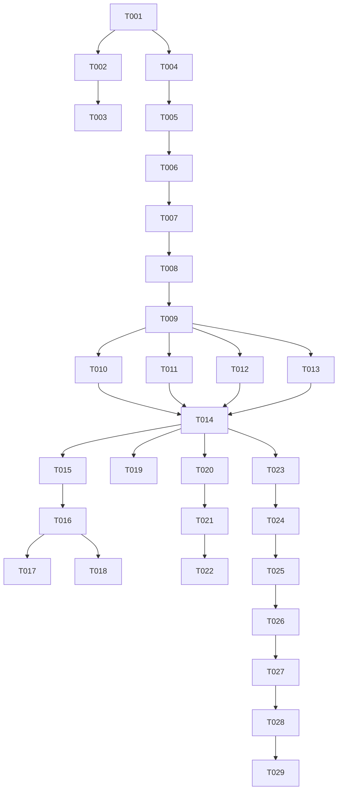

# Tasks: Replace Karma/Webpack/Jasmine with Vite/Vitest

**Feature Branch**: `001-vitest-migration`
**Spec**: [spec.md](./spec.md)
**Plan**: [plan.md](./plan.md)

## Phase 1: Setup & Infrastructure
*Goal: Initialize Vitest environment and dependencies.*

- [x] T001 Install Vitest, @vitest/browser, and Playwright dependencies in `packages/nimble-components/package.json`
- [x] T002 Create `packages/nimble-components/vitest.config.ts` with basic browser configuration (Chromium)
- [x] T003 Update `packages/nimble-components/package.json` scripts to include `test:vitest` (keeping `test` as Karma for now)
- [x] T004 [P] Create `packages/nimble-components/src/testing/spy-helpers.ts` with `createSpyObj` shim for Jasmine migration
- [x] T030 [FR-007] Configure code coverage reporting (v8) in `vitest.config.ts` and add `test:vitest:coverage` script

## Phase 2: Foundational Migration
*Goal: Establish compatibility layer and global setup.*

- [x] T005 [P] Migrate `packages/nimble-components/src/utilities/tests/setup-configuration.ts` to be compatible with Vitest (or create `setup-vitest.ts`)
- [x] T006 [P] Implement global `afterEach` cleanup in `setup-vitest.ts` to clear `document.body`
- [x] T007 [P] Verify `waitForUpdates` and async utilities work in Vitest environment (create a small proof-of-concept test file)

## Phase 3: User Story 1 - Run Unit Tests Locally (P1)
*Goal: Execute tests locally using Vitest.*

- [x] T008 [US1] Migrate a pilot component (e.g., `Drawer`) tests to Vitest syntax (replace `jasmine` globals with `vi` or shims) in `packages/nimble-components/src/drawer/tests/drawer.spec.ts`
- [x] T009 [US1] Run Vitest on the pilot component and verify pass/fail reporting
- [x] T010 [US1] [P] Bulk migrate `jasmine.createSpy` to `vi.fn` across `packages/nimble-components/src/**/*.spec.ts`
- [x] T011 [US1] [P] Bulk migrate `jasmine.createSpyObj` to `createSpyObj` helper across `packages/nimble-components/src/**/*.spec.ts` (Note: `createSpyObj` is a temporary shim; native `vi` patterns preferred for new code)
- [x] T012 [US1] [P] Bulk migrate `jasmine.clock` to `vi.useFakeTimers` across `packages/nimble-components/src/**/*.spec.ts`
- [x] T013 [US1] [P] Bulk migrate `jasmine.any` and `objectContaining` to `expect.any` / `expect.objectContaining`
- [x] T014 [US1] Verify full suite execution locally with `npm run test:vitest`

## Phase 4: User Story 2 - Cross-Browser Testing (P1)
*Goal: Ensure tests pass in Chrome, Firefox, and WebKit.*

- [x] T015 [US2] Configure `vitest.config.ts` to support CLI overrides for browser provider
- [x] T016 [US2] Add `test:vitest:firefox` and `test:vitest:webkit` scripts to `package.json`
- [x] T017 [US2] Verify pilot component tests pass in Firefox
- [x] T018 [US2] Verify pilot component tests pass in WebKit
- [x] T019 [US2] Run full suite in Firefox and WebKit and fix browser-specific failures

## Phase 5: User Story 3 - Debugging Experience (P2)
*Goal: Enable UI mode and debugging.*

- [x] T020 [US3] Add `test:vitest:ui` script to `package.json`
- [x] T021 [US3] Verify UI mode launches and allows interactive test execution
- [x] T022 [US3] Document debugging workflow (VS Code launch config) in `CONTRIBUTING.md`

## Phase 6: User Story 4 - CI Integration (P1)
*Goal: Gate PRs with Vitest.*

- [x] T023 [US4] Update GitHub Actions workflow (or Azure Pipelines) to install Playwright browsers
- [x] T024 [US4] Update CI pipeline to run `npm run test:vitest` instead of Karma
- [x] T025 [US4] Verify CI reports failures correctly

## Phase 7: Polish & Cleanup
*Goal: Remove legacy stack and finalize.*

- [ ] T026 Remove Karma, Webpack (including `karma-webpack`, `terser-webpack-plugin`, etc.), and Jasmine dependencies from `package.json` (Verify Storybook build passes after removal)
- [ ] T027 Delete `karma.conf.js` and `karma.conf.headless.js`
- [ ] T028 Rename `test:vitest` script to `test` in `package.json`
- [ ] T029 Update `packages/nimble-components/CONTRIBUTING.md` with new testing instructions
- [ ] T031 Generate beachball change file for the migration

## Dependencies

## Parallel Execution Strategy

**Phase 3 (Migration) is highly parallelizable:**
- Developer A: Migrate `jasmine.createSpy` (T010)
- Developer B: Migrate `jasmine.createSpyObj` (T011)
- Developer C: Migrate `jasmine.clock` (T012)

**Phase 4 (Browsers) can be parallelized:**
- Developer A: Verify Firefox (T017, T019)
- Developer B: Verify WebKit (T018, T019)

## Implementation Strategy
1.  **Dual Stack**: We will keep Karma running while setting up Vitest (T003).
2.  **Pilot**: We will migrate one component (`Drawer`) first to prove the config (T008).
3.  **Bulk Migration**: Once proven, we will use regex/codemods to migrate the rest of the suite (T010-T013).
4.  **Cutover**: Once CI passes (T025), we remove Karma (T026).
