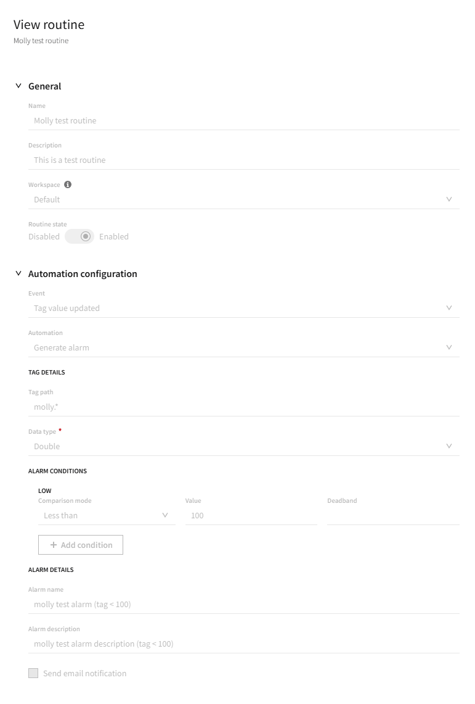
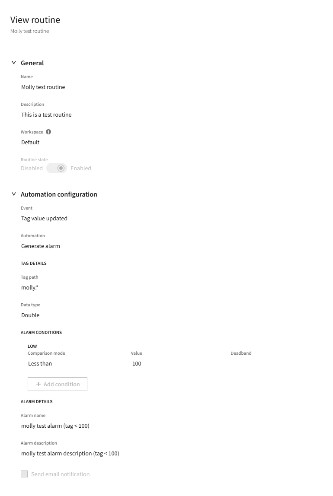
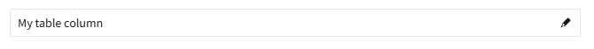
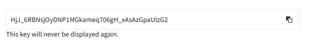

# Angular read-only form styling

## Problem Statement

There is a desire to render Angular forms with read-only controls rather than disabled controls when the control in the Angular form is marked as disabled. This is because there are use cases where the configuration represented by nimble controls is not editable but is still relevant and should be easily readable. Additionally, the only way to mark something in an Angular form as "not editable" is to mark it as disabled (i.e. there is no concept of "read only" in an Angular form). However, there is quite a bit of logic built into Angular forms and Angular's control value accessors around what it means to render a component bound to a disabled form control.

With some changes to nimble's controls and nimble's Angular control value accessors, then Angular applications could much more easily create forms with read-only controls rather than disabled controls.

An example can be seen below of a page that currently has disabled controls and the ideal UI.

Current UI with disabled controls:


Improved UI with read-only controls:


Note that in the improved UI screenshot, there are likely still additional improvements that should be made. These improvements include, but are not limited to, updating the `nimble-switch` and `nimble-checkbox` instances to no longer be disabled. However, a decision has not yet been made regarding how these components should be represented when read-only.

## Links To Relevant Work Items and Reference Material

[SLE control pattern docs](https://stratus-storybook.ni.dev/?path=/docs/patterns-control-text--docs)

## Implementation / Design

To enable this new design, the following changes need to be made within the nimble repo, each of which is discussed in more detail below:

- Introduce `readonly` configuration on the `nimble-select` and `nimble-combobox`
- Introduce `frameless` appearance to the `nimble-select`, `nimble-combobox`, and `nimble-number-field`
- Introduce `full-bleed` configuration on the `nimble-select`, `nimble-combobox`, and `nimble-number-field`
- Introduce a `readOnlyWhenDisabled` configuration on the control value accessors in Angular for the `nimble-select`, `nimble-combobox`, `nimble-text-area`, `nimble-text-field`, and `nimble-number-field`

### Read-only select and combobox

The `nimble-select` and `nimble-combobox` will be updated to have a new boolean attribute named `readonly`, which will be associated with the `readOnly` boolean property.

When these components are read-only, they will have the following characteristics:

- Tab focusable
- Cannot change their value using the mouse or keyboard
- Cannot open their popup
- Drop-down arrow (select) and drop-down button (combobox) will be hidden
- ARIA updates when read-only:
    - `aria-haspopup` set to `null`
    - `aria-readonly` set to `"true"`
    - Note: While the native select does not support `readonly`, the `combobox` role does support `aria-readonly`, so that can be used in combination with the existing role of both the `nimble-select` and `nimble-combobox`. With these two changes locally, storybook does not report any new accessibility violations.

### Frameless select, combobox, and number field

The visual design for rea-donly controls in forms is for them to be rendered without any borders or backgrounds. This matches the `frameless` appearance nimble has today for the `nimble-text-field`. Therefore, the select, combobox, and number field will all be updated to also support a `frameless` appearance.

### Full-bleed select, combobox, and number field

The visual design for read-only controls in forms is for them to be rendered without any left padding on the value (i.e. the value is aligned with the label). This matches the `full-bleed` configuration nimble has today for the `nimble-text-field`. Therefore, the select, combobox, and number field will all be updated to also support being `full-bleed`.

### Control value accessor updates

Part of Angular's `ControlValueAccessor` interface is an optional `setDisabledState` function, which is [documented here](https://angular.dev/api/forms/ControlValueAccessor#setDisabledState). All of the control value accessors currently implemented in nimble rely on an implementation of `setDisabledState` that looks like this:

```ts
setDisabledState(isDisabled: boolean): void {
    this.setProperty('disabled', isDisabled);
}
```

Because of the way that Angular injects an `NG_VALUE_ACCESSOR` for a control and because there should only be one `NG_VALUE_ACCESSOR` for a given control, the only way to change the behavior of a disabled form control is to change the control value accessor associated with it to have a different implementation of `setDisabledState`. Therefore, nimble's control value accessor directives will be updated to have the option to set `readOnly` on a control rather than `disabled`. This implementation will look like this:

```ts
@Input('readonly-when-disabled') public readOnlyWhenDisabled: boolean;

public override setDisabledState(isDisabled: boolean): void {
    if (this.readOnlyWhenDisabled) {
        this.setProperty('readOnly', isDisabled);
    } else {
        super.setDisabledState(isDisabled);
    }
}
```

The `readOnlyWhenDisabled` input will default to `false`, so existing clients of the directives will not be affected by these changes.

Additionally, nimble's control value accessors will need a small amount of logic to handle `readonly` being bound directly in a template that is using `ngModel`. This logic will be adapted from the [Angular code](https://github.com/angular/angular/blob/1b8e7ab9fe46901979389b377be4232e11092260/packages/forms/src/directives/ng_model.ts#L269) that works the same way for the `disabled` state on a control.

## Separation of responsibility

With the changes described above implemented in nimble, an application can do the following:

- Create an Angular form with nimble controls configured with `readonlyWhenDisabled`
- Update controls to use `frameless` appearance and `full-bleed` when they are read-only
    - Note: This can be done in a single-source way if a client creates an Angular directive that applies the desired attributes on nimble components based on the state of the `readonly` attribute on that component.

This allows nimble to only make unopinionated changes. Nimble will be responsible for:
- Styling the component correctly given the `readonly` state, appearance, and `full-bleed` state
- Making the component `readonly` when the form control is disabled and `readonly-when-disabled` is configured on the control value accessor directive

## Angular updates

In additional to the changes to the Angular control value accessors described above, all new `nimble-components` attributes will be exposed in the Angular directives.

## Blazor updates

Initially it is out of scope to add equivalent integration for Blazor forms. All new `nimble-components` attributes will be exposed in NimbleBlazor.

## Alternative Implementations / Designs

**Create new select component**

The native select does not have a concept of "readonly". Therefore, if we didn't feel comfortable adding the `readonly` concept to the `nimble-select` because it causes the component to diverge further from the native element, we could create a new select component either in nimble or in spright. However, it would be a significant undertaking for clients to switch to using the new component if they needed a read-only version of the control. Additionally, there already is a precedent within nimble to add APIs to components that are not part of the native element.

**Make no changes in nimble**

We could make no nimble changes and instead have applications that want read-only controls use the `nimble-text-field` for everything. This would mean that every control that could possibly be disabled needs two implementations in a template:

```html
<ng-container [form]="form">
    <nimble-text-field *ngIf="form.controls.myControl.disabled"
        formControlName="myControl"
        appearance="frameless"
        full-bleed
        readonly
    >Control label</nimble-text-field>
    <nimble-text-field *ngIf="!form.controls.myControl.disabled"
        formControlName="myControl"
    >Control label</nimble-text-field>
</ng-container>
>
```

While this would be tedious in applications, it wouldn't be technically difficult for form controls that use the `nimble-text-field` for their editable state. However, for other controls, such as the `nimble-select`, where the form value can't be written directly to a text field, there would be a significant amount of additional complexity put on every instance of the control in an application. The application would have to have logic to map the form control value to a localized string when the `nimble-select` already has logic to render display values given a value.

**Make nimble-components changes only**

The changes to add `frameless`, `full-bleed`, and `readonly` could be made to the nimble components while not making any changes to the Angular control value accessors. However, with this approach, nimble's control value accessors could not be used by applications that want to use read-only controls in Angular forms. This is because a given control should only have one control value accessor and the `setDisabledState` function has to be defined on the class that provides `NG_VALUE_ACCESSOR`, not a derived class that overrides certain functions, such as `setDisabledState`.

**Create a more opinionated read-only styles**

Rather than adding `full-bleed` and `frameless` to the select, combobox, and number field, nimble could be more opinionated about what it means for these controls to be read-only. Specifically, the style for read-only selects, comboboxes, and number fields could be to not have a border, background, or left padding on the value. However, this would be inconsistent with the implementation that already exists for the `nimble-text-field`. We also don't want to change the way `readonly` is styled for the `nimble-text-field` because there are usages of it were it is read-only and should not be styled as `frameless` and `full-bleed`. Some of these examples can be seen below:





**Repurpose the `disabled` state**

Rather than adding a `readonly` state on the select and combobox, we could re-style these components to look read-only when they are disabled. However, this approach has multiple problems including:

- Native inputs support both `readonly` and `disabled`, and there are important differences between them. For example, read-only controls are focusable and disabled controls are not.
- There are still use cases for disabled controls, and conflating the meaning of "disabled" and "read-only" would cause us difficulty in supporting both.

## Open Issues

- What is the plan for other controls, such as the checkbox and switch?
- Does the text area also need to be full-bleed and frameless?
