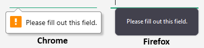

# Required Input Controls

## Problem Statement

Input controls are often used in forms or property editor dialogs. Often the user is required to provide an input to the control before the form can be submitted or before the property changes can be saved.

We need to provide a standardized way for the application to let the end-user know that a control is required.

Initially, we need this for:
- `nimble-combobox`
- `nimble-number-field`
- `nimble-radio`/`nimble-radio-group`
- `nimble-select`
- `nimble-text-area`
- `nimble-text-field`

Any other controls that could possibly be considered inputs are out of scope.

## Links To Relevant Work Items and Reference Material

- [Nimble issue](https://github.com/ni/nimble/issues/2100)
- [AzDO Feature](https://ni.visualstudio.com/DevCentral/_workitems/edit/2732543)
- [Figma design](https://www.figma.com/design/PO9mFOu5BCl8aJvFchEeuN/Nimble_Components?node-id=1295-47481)

## Implementation / Design

### API

The [native API](https://developer.mozilla.org/en-US/docs/Web/HTML/Attributes/required) for marking an input required (which is also the [Angular API](https://v17.angular.io/guide/form-validation#validating-input-in-template-driven-forms)) is:

- `required`: boolean attribute whose presence indicates that a value must be provided to submit

There are behavioral and presentational aspects of making an input participate in validation. In an ideal world, validation-related attributes like `required`, `min`, `max`, etc. would control both behavior and presentation, and frameworks like Angular and Blazor would utilize native form association APIs rather than implementing their own systems. However, given that frameworks like Angular automatically opt out of native form validation ([by setting `novalidate` on the `form` element](https://v17.angular.io/api/forms/NgForm#native-dom-validation-ui)), we don't want our validation presentations (e.g. "required" asterisk, error text/icon, and associated accessibility) coupled to the native validation system. Instead, we introduce a new attribute that controls just the presentation:

- `required-visible`: boolean attribute whose presence turns on a visual affordance (red asterisk) and accessible indication (`aria-required="true"`) that an input is required

This approach is consistent with our existing approach to validation error presentation. Rather than using the native validation state (e.g. via the `:invalid` CSS pseudo-selector) to trigger the display of error text or error icon (red exclamation mark), we have the `error-visible` attribute which gives explicit control over the error presentation. Today, `error-visible` does not manage ARIA properly (e.g. setting `aria-invalid` and `aria-errormessage`), which seems to be an oversight.

#### Radio buttons
`required-visible` will be exposed on radio button groups, but not radio buttons, since the visual only appears on the radio button group label. This is a departure from the the native API, where the `required` attribute is only exposed on radio buttons, but affects the entire radio button group. We are prioritizing an intuitive API over consistency with the native 

#### Readonly/disabled required inputs

`readonly` and/or `disabled` inputs [do not participate in native form validation](https://developer.mozilla.org/en-US/docs/Web/HTML/Attributes/readonly#attribute_interactions). Because we are decoupling the "required" presentation from the validation behavior, it is up to clients to manage whether or not the presentation is shown when a combination of `required` and `readonly`/`disabled` are present on an input.

### Visuals

We will update our templates so that setting `required-visible` causes a red asterisk to be displayed after the label, as per the visual design. For radio buttons/groups, the asterisk is on the group label, not individual button labels. We have already forked some of the templates from FAST, but we will now need to fork the ones for `nimble-number-field`, `nimble-radio-group`, and `nimble-text-field`. 

This will be implemented using a new `nimble-icon-asterisk` icon ([named consistently with Font Awesome](https://fontawesome.com/icons/asterisk)) that follows the `label` element. We will wrap the two in a `div` so that we can force a horizontal layout (`flex-direction: row`). This structure will also ensure that whatever the wrapping/ellipsizing behavior of the label is, the asterisk will always appear at the far right:

```html
<div class="annotated-label">
    <label part="label" class="label">
        <slot></slot>
    </label>
    ${when(x => x.requiredVisible, html`
        <nimble-icon-asterisk severity="error"></nimble-icon-asterisk>
    `)}
</div>
```

Styles will be shared.


### Angular & Blazor

The `required-visible` attribute will be added to the wrappers.

## Documentation

We will document the new `required-visible` attribute, but we will not add comprehensive documentation about form validation or the `required` attribute.

## Testing

Visual matrix test cases will be added for the affected components.

## Alternative Implementations / Designs

None

## Form validation

We are opting to keep our presentational API separate from the behavioral API (i.e. `required`), but for completeness, an overview of Nimble's support of the `required` attribute follows.

#### Vanilla HTML

When the user attempts to submit a form and a `required` input is missing a value, a browser-specific indicator reports the validation error:



We would expect this to already work, since the FAST components we derive from provide forms support. Unfortunately, this support is broken or incomplete for multiple components:

- `nimble-combobox`: 
    - In Chrome/Edge, a missing required value properly blocks form submission and updates the control's `validity` flags, but the visual indicator of the validation error is not shown, and instead an error is printed to the console: "An invalid form control with name='' is not focusable." Presumably, something is trying to focus the host element, though it delegates focus to the shadow DOM. The error comes from a call to [`form.requestSubmit()` in the FAST button code](https://github.com/microsoft/fast/blob/913c27e7e8503de1f7cd50bdbc9388134f52ef5d/packages/web-components/fast-foundation/src/button/button.ts#L221), which we cannot debug into. Things work properly in Firefox.
    - Accessibility: the control is not marked/announced as required. Forwarding `required` to the `input` in the template (which we have already forked) solves this.
- `nimble-text-area`:
    - Has same Chrome/Edge issue as `nimble-combobox`.
- `nimble-select`:
    - Validation incorrectly reports a missing value until a value change has occurred. I.e. the initial value is not seen. This happens because we try to mirror the initial value to the proxy native `select` element (within [a call to `super.slottedOptionsChanged()`](https://github.com/ni/nimble/blob/ddad57c4c97da9504f8146ad48668f290dae5301/packages/nimble-components/src/select/index.ts#L331)) before we have [mirrored the child option elements](https://github.com/ni/nimble/blob/ddad57c4c97da9504f8146ad48668f290dae5301/packages/nimble-components/src/select/index.ts#L346). The native `select` will reject/ignore setting `value` if it doesn't correspond to the value of one of its child options (of which it has none, at that point). Right after mirroring the child options, there is a call to `updateValue()`, but because the value has already been updated earlier, it [short-circuits](https://github.com/ni/nimble/blob/ddad57c4c97da9504f8146ad48668f290dae5301/packages/nimble-components/src/select/index.ts#L268), skipping the code path that would have updated the proxy.
    - Accessibility: the control is not marked/announced as required. The accessible control (i.e. the one defining the `role`) is the `nimble-select` itself. Since this is not a native input, the accessibility tree doesn't see/understand the `required` attribute on it. We need to additionally set `aria-required` on it (bound to `required`).
- `nimble-radio`:
    - `required` on a radio button [does not take other buttons in the group into account](https://github.com/microsoft/fast/issues/6866). It will result in a validation error if _that specific_ radio is unchecked.
    - Validity is only updated when the value or checked state changes, so if the radio button is initially unchecked and remains unchecked, it will remain marked valid, even though it violates the `required` constraint.

Forms support is complete and functional for `nimble-number-field` and `nimble-text-field`.

#### Angular

The `required` attribute only plays a role in validation for template-driven forms (with reactive forms, it is only used for accessibility purposes).

Note also that Angular's form validation support [automatically disables the native HTML form validation](https://v17.angular.io/api/forms/NgForm#native-dom-validation-ui) that would otherwise be triggered by setting the `required` attribute. This means that our Angular clients are not exposed to any of the native HTML validation bugs listed earlier in this document.

#### Blazor

Typically, form validation is handled via a `DataAnnotationsValidator`, and an input is treated as required if it is bound to a model property annotated with `RequiredAttribute` (i.e. `[Required]`).

## Open Issues

None
